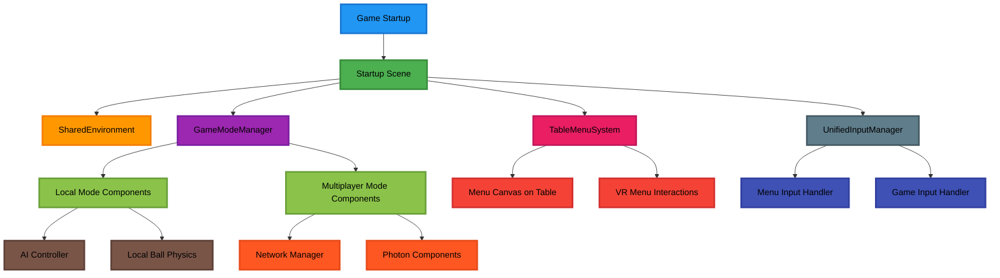
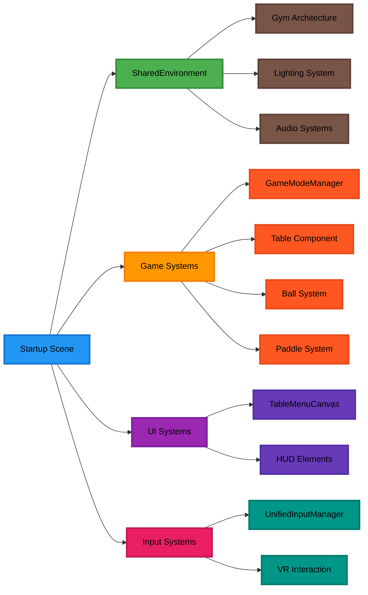
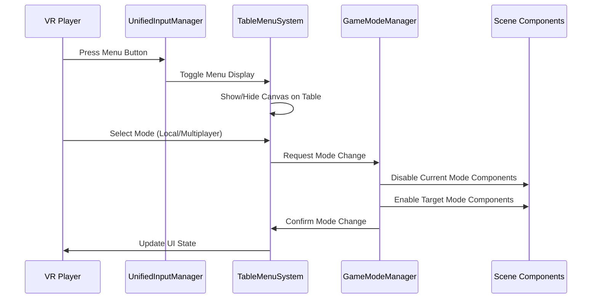

# Architecture for 菜单系统重设计

## Status: Draft

## Technical Summary

本架构文档定义了乒乓球游戏菜单系统的重设计方案。核心目标是创建一个统一的游戏场景，消除独立菜单场景的割裂感，并实现沉浸式的桌面菜单UI系统。架构采用组件状态切换模式，支持单机和多人模式的无缝切换，同时优化VR环境下的用户交互体验。

关键技术决策包括

- 统一场景架构：使用Startup场景作为默认启动场景
- 桌面菜单系统：菜单UI平铺在球桌表面，避免视野遮挡
- 组件状态管理：通过GameModeManager动态切换组件状态
- 输入系统整合：统一现有的多个输入控制器

## Technology Table

| Technology | Description |
|---|----|
| Unity 2022.3 LTS | 游戏引擎，提供VR开发支持 |
| C# | 主要开发语言 |
| Meta XR SDK | VR开发框架，支持Quest设备 |
| Unity XR Interaction Toolkit | VR交互系统，处理手柄输入和UI交互 |
| Unity Input System | 新输入系统，统一输入处理 |
| Unity UI Toolkit | 现代UI系统，用于菜单界面 |
| Photon PUN2 | 多人网络解决方案 |
| Unity Netcode | 网络同步组件 |
| SharedEnvironment Prefab | 共享环境预制体，统一场景环境 |
| Canvas World Space | 世界空间Canvas，用于桌面菜单 |

## Architectural Diagrams

### 系统架构图



### 场景结构图



### 菜单交互流程图



## Data Models

### GameMode Configuration

```csharp
public enum GameMode
{
    Local,
    Multiplayer,
    Practice,
    AIMatch
}

public class GameModeConfig
{
    public GameMode Mode { get; set; }
    public bool NetworkEnabled { get; set; }
    public bool AIEnabled { get; set; }
    public List<string> RequiredComponents { get; set; }
    public List<string> DisabledComponents { get; set; }
}
```

### Menu State Model

```csharp
public class MenuState
{
    public bool IsVisible { get; set; }
    public MenuPanel CurrentPanel { get; set; }
    public Vector3 TablePosition { get; set; }
    public Quaternion TableRotation { get; set; }
}

public enum MenuPanel
{
    Main,
    GameMode,
    Settings,
    Audio,
    Controls
}
```

### Input Configuration

```csharp
public class InputConfig
{
    public bool MenuInputEnabled { get; set; }
    public bool GameInputEnabled { get; set; }
    public float MenuToggleCooldown { get; set; }
    public Dictionary<string, InputAction> MenuActions { get; set; }
    public Dictionary<string, InputAction> GameActions { get; set; }
}
```

## Project Structure

```text
Assets/PongHub/
├── /Scenes
│   ├── Startup.unity           # 主启动场景，包含完整游戏环境
│   ├── MainMenu.unity          # 保留但不再使用的原菜单场景
│   └── /Testing                # 测试场景
├── /Scripts
│   ├── /Core
│   │   ├── GameModeManager.cs      # 游戏模式管理器
│   │   ├── UnifiedInputManager.cs  # 统一输入管理器
│   │   └── SceneController.cs      # 场景控制器
│   ├── /UI
│   │   ├── TableMenuSystem.cs      # 桌面菜单系统
│   │   ├── MenuCanvasController.cs # 菜单Canvas控制器
│   │   ├── VRMenuInteraction.cs    # VR菜单交互
│   │   └── /Panels                 # 各种菜单面板
│   ├── /Input
│   │   ├── MenuInputHandler.cs     # 菜单输入处理
│   │   └── GameInputHandler.cs     # 游戏输入处理
│   └── /Gameplay
│       ├── /Table
│       │   ├── TableMenuAnchor.cs  # 球桌菜单锚点
│       │   └── TableSurface.cs     # 球桌表面管理
│       └── /Modes
│           ├── LocalGameMode.cs    # 单机模式
│           └── MultiplayerGameMode.cs # 多人模式
├── /Prefabs
│   ├── SharedEnvironment.prefab    # 共享环境预制体
│   ├── TableMenuCanvas.prefab      # 桌面菜单Canvas
│   └── /UI                         # UI预制体
└── /Resources
    ├── /MenuAssets                 # 菜单资源
    └── /InputActions               # 输入动作配置
```

## Key Components Design

### GameModeManager

负责管理不同游戏模式的切换，动态启用/禁用相应组件。

**核心功能：**

- 模式状态管理
- 组件动态切换
- 网络状态控制
- 场景环境保持

### TableMenuSystem

实现桌面菜单的核心系统，管理菜单在球桌表面的显示和交互。

**核心功能：**

- 菜单Canvas定位
- VR交互处理
- 菜单状态管理
- 视野优化

### UnifiedInputManager

统一的输入管理系统，整合现有的多个输入控制器。

**核心功能：**

- 输入事件路由
- 菜单/游戏输入切换
- VR手柄支持
- 输入冲突解决

## Performance Considerations

### VR优化策略

- **帧率保证**：确保90fps稳定性，菜单显示时降低后台渲染负载
- **内存管理**：菜单资源按需加载，及时释放不用的UI元素
- **渲染优化**：使用UI Culling和LOD系统优化菜单渲染

### 场景切换优化

- **组件池化**：重用组件对象，避免频繁创建销毁
- **异步加载**：菜单资源异步加载，不阻塞主线程
- **状态缓存**：缓存常用状态，减少重复计算

## Security and Networking

### 网络安全

- **输入验证**：所有网络输入进行验证
- **状态同步**：确保客户端状态一致性
- **防作弊**：服务端验证关键游戏状态

### 数据保护

- **本地存储**：用户设置和偏好安全存储
- **隐私保护**：遵循VR平台隐私政策

## Change Log

| Change | Story ID | Description |
|-----|----|----|
| Initial Architecture | N/A | 初始架构设计和文档创建 |
