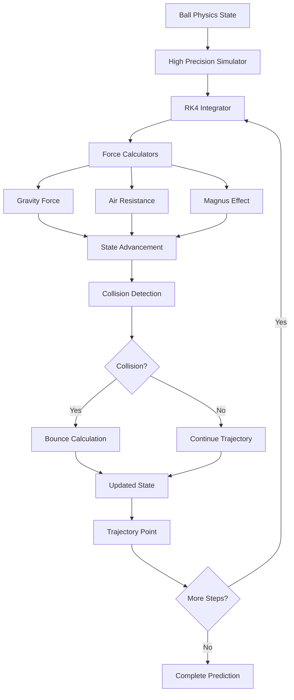
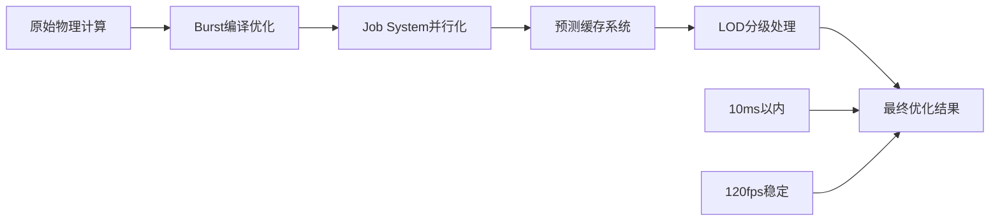

# Epic-TargetAssist: Target Assist Training System

# Story-1: 实现精确的球轨迹物理计算引擎

## Story

**As a** VR 乒乓球游戏新手玩家
**I want** 系统能够精确预测球的飞行轨迹和落点
**so that** 我可以通过可视化辅助快速理解球的运动规律并改善我的判断能力

## Status

Draft

## Context

这是 Target Assist Training System (TATS)的核心基础 Story，负责构建整个辅助系统的物理预测引擎。当前 PongHub 游戏已经有基本的球物理系统，但精度和功能不足以支持高质量的轨迹预测辅助功能。

现有系统的局限性：

- 物理更新频率不够高，预测精度有限
- 缺乏对旋转（spin）效应的精确建模
- 没有专门的轨迹预测接口
- 无法处理复杂的反弹和空气阻力计算

本 Story 将创建一个独立的高精度物理计算引擎，专门用于 TATS 系统的实时轨迹预测，不影响现有游戏的物理系统。该引擎需要支持：

1. 高频率的物理计算（120Hz 以上）
2. 精确的旋转效应建模（Magnus 效应）
3. 多步骤轨迹预测（预测未来 2-3 秒的轨迹）
4. 实时性能优化（<10ms 计算延迟）

## Estimation

Story Points: 8 (8 天开发时间，考虑到物理算法的复杂性和精度要求)

## Tasks

1. - [ ] 物理引擎架构设计和基础框架

   1. - [ ] 编写物理引擎单元测试框架
   2. - [ ] 创建 BallPhysicsState 数据结构
   3. - [ ] 设计 PhysicsSimulator 基础类架构
   4. - [ ] 实现物理常数配置系统

2. - [ ] 核心物理计算算法实现

   1. - [ ] 实现 Runge-Kutta 4 阶积分算法
   2. - [ ] 开发重力和空气阻力计算
   3. - [ ] 实现基础的碰撞检测和反弹计算
   4. - [ ] 编写算法精度验证测试

3. - [ ] 旋转效应物理建模

   1. - [ ] 实现 Magnus 效应力计算
   2. - [ ] 开发旋转对反弹影响的建模
   3. - [ ] 实现旋转衰减算法
   4. - [ ] 创建旋转效应测试用例

4. - [ ] 轨迹预测接口开发

   1. - [ ] 设计 TrajectoryCalculator 公共接口
   2. - [ ] 实现多步骤轨迹预测算法
   3. - [ ] 开发预测结果数据结构
   4. - [ ] 创建预测精度评估工具

5. - [ ] 性能优化和 Unity 集成

   1. - [ ] 集成 Unity Job System 进行并行计算
   2. - [ ] 应用 Burst Compiler 优化
   3. - [ ] 实现预测缓存和 LOD 系统
   4. - [ ] 进行性能基准测试

6. - [ ] 验证和调优
   1. - [ ] 与现实物理数据对比验证
   2. - [ ] 调优物理参数以匹配真实乒乓球特性
   3. - [ ] 进行边界条件和极端情况测试
   4. - [ ] 编写完整的文档和使用示例

## Constraints

- **性能约束**: 轨迹预测计算必须在 10ms 内完成
- **精度要求**: 1 秒内的轨迹预测误差<5cm
- **兼容性**: 必须与现有 PongHub 球物理系统兼容，不能干扰正常游戏
- **扩展性**: 需要为后续的可视化和 AI 决策系统预留接口
- **VR 优化**: 必须在 120fps VR 环境下稳定运行

## Data Models / Schema

### 核心数据结构

```csharp
// 球的物理状态
[System.Serializable]
public struct BallPhysicsState
{
    public Vector3 position;           // 3D位置
    public Vector3 velocity;           // 速度向量
    public Vector3 angularVelocity;    // 角速度（旋转）
    public float mass;                 // 质量
    public float radius;               // 半径
    public float bounciness;           // 弹性系数
    public float airResistance;        // 空气阻力系数
    public float spinDecay;            // 旋转衰减系数
    public float timestamp;            // 时间戳
}

// 轨迹预测结果
[System.Serializable]
public struct TrajectoryPrediction
{
    public Vector3[] trajectoryPoints;     // 轨迹点数组
    public Vector3 predictedLandingPoint;  // 预测落点
    public float landingTime;              // 到达时间
    public Vector3 bounceVelocity;         // 反弹后速度
    public float confidence;               // 预测置信度
    public bool willBounceOnTable;         // 是否在球台反弹
    public bool willGoOutOfBounds;         // 是否出界
    public SpinEffect spinEffect;          // 旋转影响
}

// 旋转效应数据
[System.Serializable]
public struct SpinEffect
{
    public Vector3 magnusForce;           // Magnus力向量
    public float spinRate;                // 旋转速率
    public SpinType dominantSpin;         // 主要旋转类型
    public float spinInfluenceOnBounce;   // 对反弹的影响强度
}

// 物理配置参数
[System.Serializable]
public class PhysicsConfig
{
    [Header("环境参数")]
    public float gravity = -9.81f;
    public float airDensity = 1.225f;
    public float windResistance = 0.02f;

    [Header("乒乓球参数")]
    public float ballMass = 0.0027f;      // 2.7g
    public float ballRadius = 0.02f;      // 40mm直径
    public float ballBounciness = 0.85f;

    [Header("Magnus效应参数")]
    public float magnusCoefficient = 0.1f;
    public float spinDecayRate = 0.95f;

    [Header("数值积分参数")]
    public int maxPredictionSteps = 300;   // 最大预测步数
    public float timeStep = 0.01f;         // 时间步长
    public float maxPredictionTime = 3.0f; // 最大预测时间
}
```

### 主要接口定义

```csharp
// 物理模拟器接口
public interface IPhysicsSimulator
{
    TrajectoryPrediction PredictTrajectory(BallPhysicsState initialState, float duration);
    Vector3 CalculateAcceleration(BallPhysicsState state);
    BallPhysicsState AdvanceState(BallPhysicsState state, float deltaTime);
    bool DetectTableCollision(Vector3 position, Vector3 velocity, out Vector3 collisionPoint, out Vector3 normal);
}

// 轨迹计算器接口
public interface ITrajectoryCalculator
{
    TrajectoryPrediction CalculateTrajectory(BallPhysicsState initialState);
    void UpdatePrediction(BallPhysicsState currentState);
    float GetPredictionConfidence();
    void SetPredictionParameters(int steps, float timeStep, float maxTime);
}
```

## Structure

```
Assets/PongHub/Scripts/TargetAssist/Prediction/
├── Core/
│   ├── IPhysicsSimulator.cs              # 物理模拟器接口
│   ├── ITrajectoryCalculator.cs          # 轨迹计算器接口
│   ├── PhysicsConfig.cs                  # 物理配置参数
│   └── TATSPhysicsConstants.cs           # 物理常数定义
├── Engine/
│   ├── HighPrecisionPhysicsSimulator.cs  # 高精度物理模拟器
│   ├── TrajectoryCalculator.cs           # 轨迹计算引擎
│   ├── RungeKuttaIntegrator.cs           # RK4积分器
│   └── CollisionDetector.cs              # 碰撞检测系统
├── Effects/
│   ├── MagnusEffectCalculator.cs         # Magnus效应计算器
│   ├── SpinEffectProcessor.cs            # 旋转效应处理器
│   └── AirResistanceCalculator.cs        # 空气阻力计算器
├── Optimization/
│   ├── PredictionJobs.cs                 # Unity Job System作业
│   ├── PredictionCache.cs                # 预测结果缓存
│   └── LODPredictionSystem.cs            # 分级预测系统
└── Testing/
    ├── PhysicsValidationTests.cs         # 物理验证测试
    ├── PerformanceBenchmarks.cs          # 性能基准测试
    └── AccuracyMeasurement.cs            # 精度测量工具
```

## Diagrams

### 物理引擎数据流图



### 算法性能优化策略



## Dev Notes

### 关键技术决策

1. **选择 Runge-Kutta 4 阶积分算法**

   - 优点：高精度，数值稳定性好
   - 缺点：计算量比欧拉方法大，但在现代硬件上可接受
   - 替代方案：Verlet 积分（更适合游戏，但精度稍低）

2. **Magnus 效应建模**

   - 使用简化的 Magnus 力模型：F = ρ _ V _ (ω × v) \* C
   - 需要根据实际测试数据调优 Magnus 系数
   - 考虑不同旋转类型（上旋、下旋、侧旋）的不同影响

3. **性能优化策略**

   - Unity Job System 用于并行计算多个轨迹点
   - Burst Compiler 提供原生代码性能
   - 预测缓存避免重复计算
   - LOD 系统根据重要性调整计算精度

4. **与现有系统的集成**
   - 保持独立性，不修改现有球物理代码
   - 通过事件系统获取球状态更新
   - 提供统一的预测接口给可视化系统使用

### 实现风险和缓解措施

1. **计算性能风险**

   - 风险：复杂的物理计算可能导致帧率下降
   - 缓解：使用 Job System 异步计算，分帧处理复杂预测

2. **精度 vs 性能平衡**

   - 风险：高精度计算可能影响实时性
   - 缓解：实现可配置的精度等级，根据需求动态调整

3. **物理参数调优复杂性**
   - 风险：Magnus 效应等参数难以从理论确定
   - 缓解：建立测试框架，支持参数的实时调优和 A/B 测试

### 测试策略

1. **单元测试**：每个物理计算函数的正确性验证
2. **集成测试**：完整轨迹预测的精度测试
3. **性能测试**：不同复杂度场景下的性能基准
4. **真实性验证**：与实际乒乓球物理行为对比

## Chat Command Log

- User: 参考 autoAim 技术，为乒乓球 VR 游戏设计目标辅助练习系统
- AI: 已创建完整的 PRD、架构文档和第一个 Story，系统借鉴 autoAim 的预测和引导思想，专注于新手训练辅助

---

**Created**: 2025 年 7 月 15 日  
**Last Updated**: 2025 年 7 月 15 日  
**Estimated Completion**: 预计 8 个工作日  
**Dependencies**: 无（独立开发）  
**Risk Level**: 中等（主要来自性能和精度平衡）
