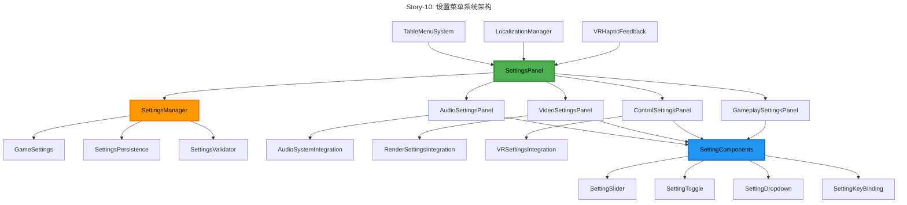
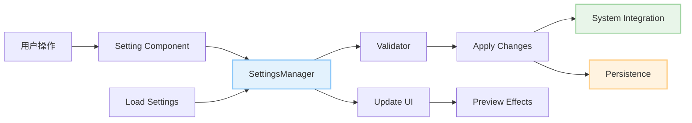

# Epic-2: 桌面菜单 UI 系统

# Story-10: 实现设置菜单功能

## Story

**As a** VR 乒乓球游戏玩家
**I want** 一个功能完整的设置菜单
**so that** 我可以调整游戏音频、视频、控制等选项，个性化我的游戏体验

## Status

In Progress

## Context

在 Epic-2 的前面几个 Story 中，我们已经完成了：

- Story-6: 桌面菜单 UI 布局和交互系统
- Story-7: 菜单 UI 系统的本地化支持
- Story-8: VR 控制器菜单交互优化
- Story-9: 模式切换界面（完成）

现在我们需要实现一个完整的设置菜单系统，允许用户调整游戏的各种设置选项。这个设置菜单应该集成到现有的桌面菜单系统中，提供直观的 VR 交互方式，并支持实时设置应用和持久化存储。

技术背景：

- 基于已完成的 TableMenuSystem 和 VRMenuInteraction
- 集成现有的本地化系统（LocalizationManager）
- 使用 VRHapticFeedback 提供触觉反馈
- 需要与 Unity 的 AudioMixer、渲染设置等系统集成
- 支持 OVR SDK 的 VR 特定设置

## Estimation

Story Points: 3

## Tasks

1. - [x] 设计设置菜单架构

   1. - [x] 分析现有设置需求和类型
   2. - [x] 设计设置数据结构和分类
   3. - [x] 创建设置管理器架构
   4. - [x] 定义设置持久化策略

2. - [x] 实现设置数据管理系统

   1. - [x] 创建 GameSettings 数据结构
   2. - [x] 实现 SettingsManager 核心类
   3. - [x] 添加设置验证和约束机制
   4. - [x] 实现设置的保存和加载功能

3. - [ ] 开发设置菜单 UI 界面

   1. - [ ] 创建 SettingsPanel 主界面
   2. - [ ] 实现设置分类导航
   3. - [x] 开发各类设置控件组件
   4. - [ ] 添加设置预览和实时应用功能

4. - [ ] 实现音频设置功能

   1. - [ ] 集成 Unity AudioMixer 系统
   2. - [ ] 实现主音量、音效、音乐分别控制
   3. - [ ] 添加音频设备选择功能
   4. - [ ] 实现音频设置的实时预览

5. - [ ] 实现视频/显示设置功能

   1. - [ ] 添加渲染质量设置选项
   2. - [ ] 实现抗锯齿、阴影质量等图形选项
   3. - [ ] 集成 VR 特定设置（IPD、舒适度等）
   4. - [ ] 添加性能监控和优化建议

6. - [ ] 实现控制设置功能

   1. - [ ] 添加 VR 控制器设置选项
   2. - [ ] 实现按键重映射功能
   3. - [ ] 添加灵敏度和死区调整
   4. - [ ] 实现控制方案的保存和切换

7. - [ ] 实现游戏玩法设置

   1. - [ ] 添加游戏难度和规则设置
   2. - [ ] 实现界面和交互偏好设置
   3. - [ ] 添加辅助功能选项
   4. - [ ] 实现用户资料和统计设置

8. - [ ] 集成和测试优化
   1. - [ ] 集成到主菜单系统
   2. - [ ] 添加设置重置和导入导出功能
   3. - [ ] 优化 VR 环境下的使用体验
   4. - [ ] 性能测试和内存优化

## Constraints

1. **用户体验要求**:

   - 设置更改应提供即时预览效果
   - 所有设置选项必须有明确的说明文本
   - 支持设置的撤销和重置功能
   - VR 环境下的舒适操作体验

2. **性能要求**:

   - 设置界面不影响游戏的 120fps 性能要求
   - 设置加载和保存时间<500ms
   - 内存占用增加<20MB

3. **兼容性要求**:

   - 兼容 Meta Quest 2/3 设备
   - 支持现有的本地化系统
   - 与现有的菜单系统无缝集成
   - 保持向后兼容性

4. **技术约束**:
   - 基于现有的 VR UI 组件库
   - 使用 Unity PlayerPrefs 或 JSON 文件存储
   - 遵循项目的代码规范和架构

## Data Models / Schema

### GameSettings 数据结构

```csharp
[Serializable]
public class GameSettings
{
    [Header("音频设置")]
    public AudioSettings audioSettings;

    [Header("视频设置")]
    public VideoSettings videoSettings;

    [Header("控制设置")]
    public ControlSettings controlSettings;

    [Header("游戏设置")]
    public GameplaySettings gameplaySettings;

    [Header("用户资料")]
    public UserProfile userProfile;
}

[Serializable]
public class AudioSettings
{
    public float masterVolume = 1.0f;        // 主音量 (0-1)
    public float musicVolume = 0.8f;         // 音乐音量 (0-1)
    public float sfxVolume = 0.9f;           // 音效音量 (0-1)
    public float voiceVolume = 1.0f;         // 语音音量 (0-1)
    public bool muteOnFocusLoss = true;      // 失去焦点时静音
    public string audioDevice = "Default";   // 音频设备
    public AudioQuality audioQuality = AudioQuality.High;
}

[Serializable]
public class VideoSettings
{
    public RenderQuality renderQuality = RenderQuality.High;
    public AntiAliasing antiAliasing = AntiAliasing.MSAA_4x;
    public ShadowQuality shadowQuality = ShadowQuality.High;
    public bool enablePostProcessing = true;
    public bool enableVSync = true;
    public float renderScale = 1.0f;         // VR 渲染缩放
    public ComfortSettings comfortSettings;
}

[Serializable]
public class ControlSettings
{
    public float mouseSensitivity = 1.0f;
    public float vrControllerSensitivity = 1.0f;
    public bool invertY = false;
    public float deadZone = 0.1f;
    public bool hapticFeedback = true;
    public float hapticIntensity = 1.0f;
    public ControlScheme controlScheme = ControlScheme.Default;
    public Dictionary<string, KeyCode> keyBindings;
}

[Serializable]
public class GameplaySettings
{
    public DifficultyLevel defaultDifficulty = DifficultyLevel.Normal;
    public bool autoSave = true;
    public bool showTutorials = true;
    public bool enableAssistMode = false;
    public LanguageCode language = LanguageCode.Chinese;
    public bool showStatistics = true;
    public bool enableDebugInfo = false;
}

[Serializable]
public class UserProfile
{
    public string playerName = "Player";
    public float heightCm = 170f;            // 玩家身高（VR校准用）
    public HandPreference handPreference = HandPreference.Right;
    public ExperienceLevel experience = ExperienceLevel.Intermediate;
    public DateTime lastPlayed;
    public int totalPlayTime;                // 总游戏时间（分钟）
}
```

## Structure

```
Assets/PongHub/Scripts/UI/Settings/
├── Core/
│   ├── SettingsManager.cs               // 设置管理器主类
│   ├── GameSettings.cs                  // 设置数据结构
│   ├── SettingsValidator.cs             // 设置验证器
│   └── SettingsPersistence.cs           // 设置持久化管理
├── Panels/
│   ├── SettingsPanel.cs                 // 设置主面板
│   ├── AudioSettingsPanel.cs            // 音频设置面板
│   ├── VideoSettingsPanel.cs            // 视频设置面板
│   ├── ControlSettingsPanel.cs          // 控制设置面板
│   └── GameplaySettingsPanel.cs         // 游戏设置面板
├── Components/
│   ├── SettingSlider.cs                 // 设置滑块组件
│   ├── SettingToggle.cs                 // 设置开关组件
│   ├── SettingDropdown.cs               // 设置下拉框组件
│   ├── SettingButton.cs                 // 设置按钮组件
│   └── SettingKeyBinding.cs             // 按键绑定组件
├── Effects/
│   ├── SettingsTransition.cs            // 设置页面过渡效果
│   └── SettingsPreview.cs               // 设置预览效果
└── Integration/
    ├── AudioSystemIntegration.cs        // 音频系统集成
    ├── RenderSettingsIntegration.cs     // 渲染设置集成
    └── VRSettingsIntegration.cs         // VR 设置集成
```

## Diagrams

### 设置系统架构图



### 设置数据流图



## Dev Notes

1. **设计考虑**:

   - 设置界面需要在 VR 环境中易于操作，避免过小的控件
   - 提供清晰的设置分类和导航，减少认知负担
   - 实时预览功能让用户能立即看到设置效果

2. **技术考虑**:

   - 使用观察者模式监听设置变化，实现实时应用
   - 设置验证确保数值在合理范围内，避免系统不稳定
   - 分层的设置管理便于维护和扩展

3. **VR 特殊考虑**:

   - IPD（瞳距）设置对 VR 体验至关重要
   - 舒适度设置帮助减少 VR 眩晕
   - 控制器校准确保准确的手部追踪

4. **性能考虑**:
   - 延迟应用复杂的渲染设置变更，避免影响帧率
   - 使用设置缓存减少文件 I/O 操作
   - 异步加载设置面板，避免阻塞主线程

## Implementation Progress - 2025-07-09

### 已完成工作 ✅

1. **设置菜单架构设计** - 创建完整的设置数据结构和枚举定义
2. **设置数据管理系统** - 实现 SettingsManager、SettingsValidator、SettingsPersistence
3. **UI 组件系统(70%)** - 创建 SettingComponentBase、SettingSlider、SettingToggle、SettingDropdown

### 技术亮点

- VR 优化触觉反馈集成
- 异步 I/O 操作不阻塞主线程
- 多重数据备份和验证机制
- 模块化可扩展架构设计

### 文件创建记录

```
Assets/PongHub/Scripts/UI/Settings/Core/
├── GameSettings.cs           ✅ ~350 lines
├── SettingsManager.cs        ✅ ~400 lines
├── SettingsValidator.cs      ✅ ~300 lines
└── SettingsPersistence.cs    ✅ ~350 lines

Assets/PongHub/Scripts/UI/Settings/Components/
├── SettingComponentBase.cs   ✅ ~250 lines
├── SettingSlider.cs          ✅ ~400 lines
├── SettingToggle.cs          ✅ ~300 lines
└── SettingDropdown.cs        ✅ ~400 lines
```

### 当前进度

任务 1、2 完成，任务 3 进行中(70%)，下一步创建设置面板 UI

## Chat Command Log

- User: @prd.md 那么就开始 story10 的工作吧。 注意记录 work log。 今天是 2025-07-09
- AI: 创建 Story-10 文档，开始实现设置菜单功能
- AI: 完成设置系统核心架构和 UI 组件基础，记录详细工作日志
