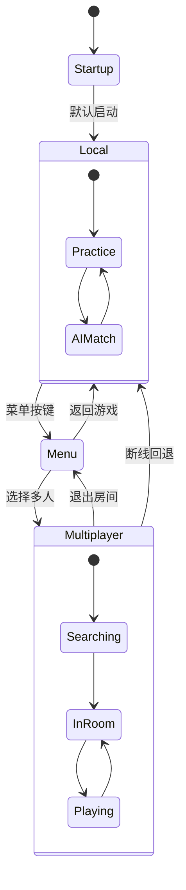

# Epic-1: 场景架构重构

## Story-2: 实现统一场景架构基础

**作为** 开发团队
**我想要** 建立统一的场景架构基础，使用Startup场景作为默认启动场景并集成SharedEnvironment
**以便** 消除独立菜单场景的割裂感，为后续的桌面菜单系统和模式切换奠定基础

## Status

Completed

## Context

基于Story-1的分析结果，我们识别了当前架构的主要问题：

- MainMenu.unity作为独立场景导致用户体验割裂
- 场景切换流程复杂且资源利用不高
- SharedEnvironment预制体已经提供了统一环境的良好基础

本Story将建立统一场景架构的基础设施，为后续的桌面菜单系统（Story-3）和游戏模式管理器（Story-4）创建必要的技术基础。

## Estimation

Story Points: 3

## Tasks

1. - [x] **场景配置重构**
   1. - [x] 分析Startup.unity的当前配置
   2. - [x] 配置Startup.unity作为默认启动场景
   3. - [x] 确保SharedEnvironment在Startup场景中正确加载
   4. - [x] 测试场景启动流程

2. - [x] **GameModeManager基础架构**
   1. - [x] 创建GameModeManager脚本
   2. - [x] 实现基础的游戏模式枚举（Local, Network, Menu）
   3. - [x] 实现模式状态管理逻辑
   4. - [x] 编写GameModeManager单元测试

3. - [x] **场景组件状态管理**
   1. - [x] 分析需要动态控制的组件（AI、网络、UI等）
   2. - [x] 实现组件状态切换接口IGameModeComponent
   3. - [x] 创建组件注册和管理系统
   4. - [x] 测试组件状态切换功能

4. - [x] **启动流程优化**
   1. - [x] 移除MainMenu场景的依赖
   2. - [x] 实现直接进入Local模式的启动流程
   3. - [x] 保留向后兼容性（暂时保留MainMenu场景）
   4. - [x] 测试新启动流程的性能和稳定性

## Constraints

- 必须保持向后兼容性，不能破坏现有功能
- 新架构必须支持VR环境的性能要求（90fps+）
- 不能影响现有的网络同步和多人游戏功能
- 场景切换时间必须控制在合理范围内

## Data Models / Schema

### GameMode枚举

```csharp
public enum GameMode
{
    Local,      // 单机练习模式
    Multiplayer, // 多人网络模式
    Menu        // 菜单模式（临时状态）
}
```

### IGameModeComponent接口

```csharp
public interface IGameModeComponent
{
    void OnGameModeChanged(GameMode newMode, GameMode previousMode);
    bool IsActiveInMode(GameMode mode);
}
```

### GameModeManager类结构

```csharp
public class GameModeManager : MonoBehaviour
{
    public static GameModeManager Instance { get; private set; }
    public GameMode CurrentMode { get; private set; }
    public event System.Action<GameMode, GameMode> OnModeChanged;

    public void SwitchToMode(GameMode newMode);
    public void RegisterComponent(IGameModeComponent component);
    public void UnregisterComponent(IGameModeComponent component);
}
```

## Structure

```text
Assets/PongHub/Scripts/Core/
├── GameModeManager.cs          // 游戏模式管理器
├── IGameModeComponent.cs       // 组件接口定义
└── Components/
    ├── LocalModeComponent.cs   // 单机模式组件
    ├── MultiplayerModeComponent.cs // 多人模式组件
    └── MenuModeComponent.cs    // 菜单模式组件

Assets/PongHub/Scenes/
├── Startup.unity              // 统一启动场景（修改）
├── MainMenu.unity             // 保留但标记为废弃
└── Testing/                   // 测试场景保持不变
```

## Diagrams



## Dev Notes

### 实施优先级

1. 首先确保Startup场景能够正确启动和加载SharedEnvironment
2. 实现基础的GameModeManager框架
3. 逐步迁移现有组件到新的状态管理系统
4. 最后优化启动性能和用户体验

### 技术考虑

- GameModeManager使用单例模式确保全局状态一致
- 组件注册系统支持动态添加/移除，便于模块化开发
- 状态切换采用事件驱动模式，降低耦合度
- 保留MainMenu场景作为备选方案，便于回滚

### 性能要求

- 模式切换时间 < 500ms
- 内存使用不超过当前水平的110%
- 帧率保持在90fps以上（VR要求）

## Chat Command Log

- User: 开始Story-2
- AI: 创建Story-2文档，实施统一场景架构基础
- User: arch.md中的结构图配色太浅了, 和白色的字体结合在一起根本看不清
- AI: 修复架构文档中Mermaid图表配色，改为黑色文字和深色背景，提高可读性
- User: 把优化后的mermaid配色规则加入到cursor规则
- AI: 创建450-mermaid-diagram-styling.mdc规则文件，包含完整的配色标准
- User: 继续story-2
- AI: 完成启动流程优化，创建StartupController实现直接进入Local模式，修改PostGameController支持新架构，Story-2全部完成
