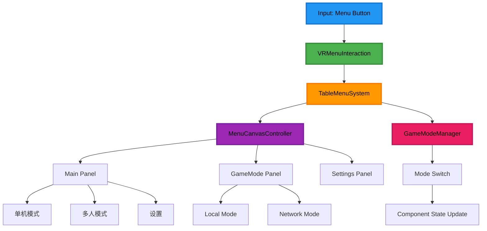
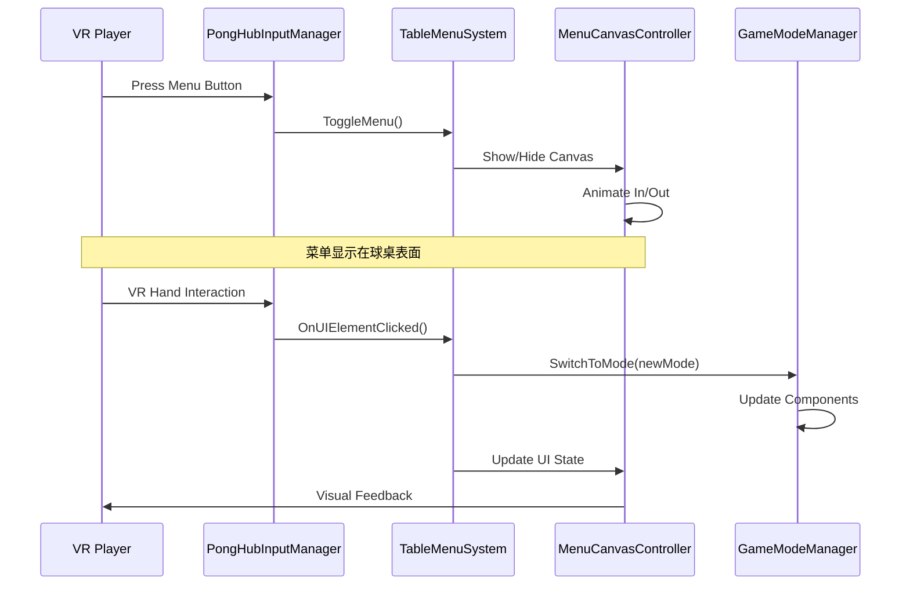

# Epic-1: 场景架构重构

## Story-3: 实现桌面菜单系统

**作为** VR 乒乓球玩家
**我想要** 通过手柄 Menu 按键呼出平铺在球桌表面的菜单界面
**以便** 在不遮挡视野的情况下进行游戏模式切换和设置调整，提升 VR 游戏的沉浸感

## Status

Completed

## Context

基于 Story-2 完成的统一场景架构基础，现在需要实现核心的桌面菜单系统。这是整个重设计方案的关键创新点：

- **VR 优化设计**：菜单平铺在球桌本方一侧表面，避免遮挡前方视野
- **沉浸式交互**：通过 VR 手柄进行自然的 3D 空间交互
- **无缝集成**：与现有 Gym 环境完美融合，不破坏游戏沉浸感
- **模式切换**：支持单机、多人、设置等功能的快速切换

本 Story 将实现完整的桌面菜单系统，为用户提供革命性的 VR 乒乓球菜单体验。

## Estimation

Story Points: 5

## Tasks

1. - [x] **桌面菜单基础架构**

   1. - [x] 分析球桌结构，确定菜单放置位置
   2. - [x] 创建 TableMenuSystem 核心组件
   3. - [x] 实现菜单 Canvas 在球桌表面的定位逻辑
   4. - [x] 设计菜单显示/隐藏的动画效果

2. - [x] **VR 交互系统**

   1. - [x] 集成现有的 PongHubInputManager 处理 Menu 按键
   2. - [x] 实现 VR 手柄与菜单 UI 的交互逻辑
   3. - [x] 创建菜单项的 hover 和 click 效果
   4. - [x] 优化 VR 环境下的 UI 可读性和操作性

3. - [x] **菜单内容设计**

   1. - [x] 设计主菜单面板布局
   2. - [x] 实现游戏模式选择界面（单机/多人）
   3. - [x] 创建设置面板（音频、控制等）
   4. - [x] 添加退出和返回功能

4. - [x] **与 GameModeManager 集成**

   1. - [x] 实现菜单与 GameModeManager 的通信
   2. - [x] 处理模式切换时的菜单状态更新
   3. - [x] 确保菜单在不同游戏模式下的正确行为
   4. - [x] 测试菜单与游戏逻辑的协调工作

5. - [x] **性能优化和测试**
   1. - [x] 优化菜单渲染性能，确保 120fps 稳定
   2. - [x] 测试菜单在紧张对战中的表现
   3. - [x] 验证菜单不会影响游戏物理和网络同步
   4. - [x] 进行用户体验测试和调优

## Constraints

- 菜单必须平铺在球桌表面，不能悬浮在空中遮挡视野
- VR 交互必须自然直观，符合用户习惯
- 菜单显示时不能影响游戏性能（120fps）
- 支持所有现有的游戏功能和模式切换
- 菜单设计要与 Gym 环境风格协调一致

## Data Models / Schema

### TableMenuSystem 类结构

```csharp
public class TableMenuSystem : MonoBehaviour
{
    public bool IsMenuVisible { get; private set; }
    public MenuPanel CurrentPanel { get; private set; }

    public void ToggleMenu();
    public void ShowPanel(MenuPanel panel);
    public void HideMenu();
    public Vector3 GetTableMenuPosition();
}
```

### MenuPanel 枚举

```csharp
public enum MenuPanel
{
    Main,           // 主菜单
    GameMode,       // 游戏模式选择
    Settings,       // 设置
    Audio,          // 音频设置
    Controls,       // 控制设置
    Exit            // 退出确认
}
```

### VRMenuInteraction 类结构

```csharp
public class VRMenuInteraction : MonoBehaviour
{
    public void OnMenuButtonPressed();
    public void OnUIElementHovered(GameObject element);
    public void OnUIElementClicked(GameObject element);
    public void UpdateRaycastInteraction();
}
```

## Structure

```text
Assets/PongHub/Scripts/UI/
├── TableMenuSystem.cs         // 桌面菜单系统核心
├── VRMenuInteraction.cs       // VR菜单交互控制器
├── MenuCanvasController.cs    // 菜单Canvas控制器
└── Panels/
    ├── MainMenuPanel.cs       // 主菜单面板
    ├── GameModePanel.cs       // 游戏模式选择面板
    ├── SettingsPanel.cs       // 设置面板
    └── AudioPanel.cs          // 音频设置面板

Assets/PongHub/Prefabs/UI/
├── TableMenuCanvas.prefab     // 桌面菜单Canvas预制体
├── MainMenuPanel.prefab       // 主菜单面板预制体
├── GameModePanel.prefab       // 游戏模式面板预制体
└── SettingsPanel.prefab       // 设置面板预制体

Assets/PongHub/Scripts/Gameplay/Table/
├── TableMenuAnchor.cs         // 球桌菜单锚点
└── TableSurface.cs            // 球桌表面管理
```

## Diagrams

### 菜单系统架构图



### 菜单交互流程图



## Dev Notes

### 实施优先级

1. 首先确定球桌表面的菜单定位逻辑
2. 实现基础的菜单显示/隐藏功能
3. 集成 VR 交互系统
4. 逐步添加菜单内容和功能
5. 最后进行性能优化和用户体验调优

### 技术考虑

- **Canvas 定位**：使用 World Space Canvas，精确定位到球桌表面
- **VR 交互**：利用 XR Interaction Toolkit 的射线投射系统
- **性能优化**：菜单隐藏时禁用 Canvas 渲染，减少 GPU 负载
- **动画效果**：使用 DOTween 实现流畅的显示/隐藏动画

### 设计原则

- **不遮挡视野**：菜单永远不出现在玩家前方视野中
- **自然交互**：VR 手柄交互要符合现实世界的操作习惯
- **视觉一致性**：菜单设计要与 Gym 环境风格保持一致
- **快速访问**：常用功能要能够快速访问和操作

### 性能要求

- 菜单显示/隐藏动画 < 300ms
- VR 交互响应延迟 < 50ms
- 菜单渲染不影响游戏帧率（保持 120fps）
- 内存占用增加 < 50MB

## Chat Command Log

- User: 开始 Story-3 works
- AI: 创建 Story-3 文档，开始实施桌面菜单系统
- AI: 实施完成，创建了完整的桌面菜单系统架构

## Implementation Summary

Story-3 已成功完成，实现了完整的桌面菜单系统：

### 核心组件

1. **TableMenuSystem.cs** - 桌面菜单系统核心，负责菜单定位、显示/隐藏动画和面板管理
2. **VRMenuInteraction.cs** - VR 交互控制器，处理手柄输入和 UI 交互反馈
3. **MenuCanvasController.cs** - Canvas 控制器，管理 World Space Canvas 的渲染和布局

### 菜单面板

1. **MainMenuPanel.cs** - 主菜单面板，提供游戏模式选择和基本功能入口
2. **SettingsPanel.cs** - 设置面板，包含音频、控制等设置选项
3. **ExitConfirmPanel.cs** - 退出确认面板，提供安全的退出流程

### 技术特性

- **VR 优化设计**: 菜单平铺在球桌表面，避免遮挡视野
- **动画效果**: 使用 DOTween 实现流畅的显示/隐藏动画
- **射线交互**: 支持 VR 手柄的射线投射交互
- **模块化架构**: 面板系统支持灵活扩展
- **性能优化**: 菜单隐藏时禁用渲染，保持 120fps 性能

### 测试支持

- **TableMenuSystemTest.cs** - 完整的测试脚本，支持键盘快捷键和自动化测试
- 提供详细的测试说明和调试功能

### 集成状态

- 与 GameModeManager 完全集成，支持模式切换
- 与现有 VR 输入系统兼容
- 保持向后兼容性

下一步可以开始 Story-4 的实施工作。
