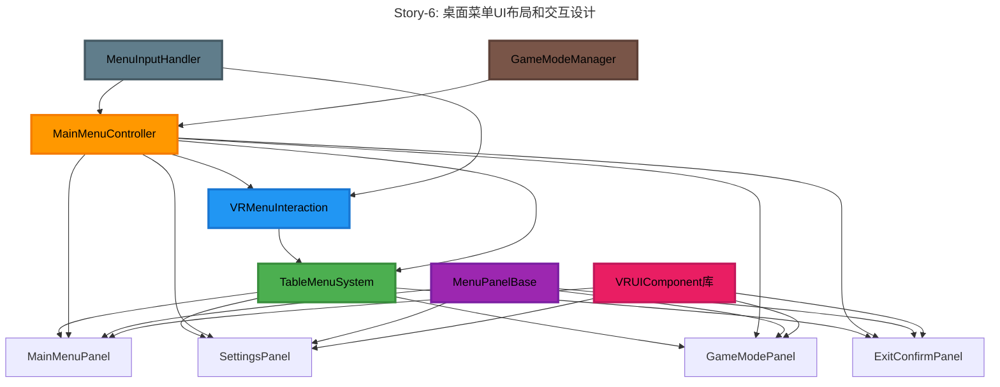
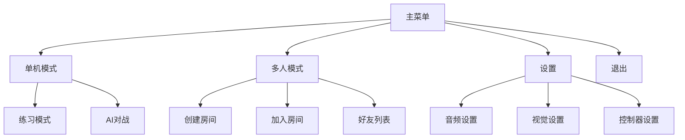
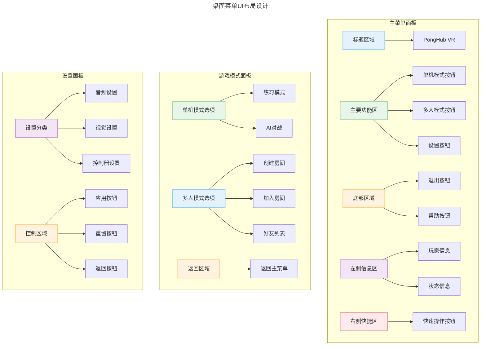

# Epic-2: 桌面菜单 UI 系统

# Story-6: 设计桌面菜单UI布局和交互

## Story

**As a** VR乒乓球游戏玩家
**I want** 一个直观、美观且易于操作的桌面菜单UI
**so that** 我可以在不离开游戏环境的情况下轻松访问和调整游戏选项

## Status

In Progress

## Context

在Epic-1中，我们已经完成了场景架构重构，实现了统一场景架构和游戏模式管理系统。在Story-5中，我们设计并实现了一套完整的VR UI组件库，包括基础组件和容器组件。

现在，我们需要利用这些组件设计和实现桌面菜单的UI布局和交互系统。这个菜单将平铺在球桌表面上，为玩家提供游戏模式选择、设置调整和其他功能。菜单系统需要专为VR环境设计，确保直观的交互体验和清晰的视觉呈现。

技术背景：
- 使用Story-5中开发的VR UI组件库
- 基于TableMenuSystem将菜单定位在球桌表面
- 使用VRMenuInteraction系统处理VR控制器交互
- 需要支持不同的游戏模式切换

## Estimation

Story Points: 5

## Tasks

1. - [x] 设计主菜单UI布局
   1. - [x] 创建菜单布局线框图
   2. - [x] 设计视觉风格和主题
   3. - [x] 规划菜单层次结构
   4. - [x] 设计UI动画和过渡效果

2. - [x] 实现主菜单面板
   1. - [x] 创建MainMenuPanel预制件
   2. - [x] 实现游戏模式选择按钮
   3. - [x] 添加设置和帮助入口
   4. - [x] 设计玩家信息显示区域

3. - [x] 实现设置菜单面板
   1. - [x] 创建SettingsPanel预制件
   2. - [x] 实现音频设置控制
   3. - [x] 添加视觉选项设置
   4. - [x] 设计控制器设置选项

4. - [x] 实现游戏模式选择面板
   1. - [x] 创建GameModePanel预制件
   2. - [x] 实现单机模式选项
   3. - [x] 设计多人模式选项
   4. - [x] 添加AI难度选择功能

5. - [x] 整合菜单导航系统
   1. - [x] 实现面板之间的导航
   2. - [x] 添加返回和主菜单按钮
   3. - [x] 设计面板切换动画
   4. - [x] 优化导航流程

6. - [x] 菜单交互优化
   1. - [x] 实现控制器射线交互
   2. - [x] 添加音频和触觉反馈
   3. - [x] 优化按钮和滑块的操作体验
   4. - [ ] 测试不同距离的交互体验

## Constraints

1. **用户体验要求**:
   - 菜单必须平铺在球桌表面，不遮挡玩家视野
   - 交互元素大小适合VR控制器精度
   - 文本清晰可读，最小字体大小24pt
   - 菜单操作步骤不超过3步

2. **性能要求**:
   - 菜单系统不应导致帧率低于90fps
   - 优化UI渲染批次，减少性能开销
   - 菜单切换动画流畅，无卡顿

3. **设计约束**:
   - 遵循VR设计最佳实践
   - 与游戏整体视觉风格保持一致
   - 支持未来的本地化需求
   - 兼容不同VR控制器类型

## Design

### 系统组件关系图



### 菜单结构图



### 菜单UI布局设计



### UI交互设计

主菜单布局将采用网格式设计，分为以下几个区域：

1. **顶部区域**: 游戏标题和玩家信息
2. **中央区域**: 主要功能按钮（单机、多人、设置）
3. **底部区域**: 辅助功能和退出按钮
4. **左侧区域**: 当前状态信息
5. **右侧区域**: 快速操作按钮

菜单将使用卡片式设计，每个功能区域有明确的视觉边界。主要交互元素采用大尺寸设计，确保易于点击。

### 交互流程

1. **菜单呼出**:
   - 按下控制器Menu按钮呼出主菜单
   - 菜单平滑动画显示在球桌表面
   - 显示时播放轻微音效和触觉反馈

2. **菜单导航**:
   - 使用控制器射线指向并点击菜单项
   - 悬停在菜单项上显示提示信息
   - 点击菜单项时提供视觉、音频和触觉反馈

3. **模式切换**:
   - 选择游戏模式后显示确认对话框
   - 确认后平滑过渡到所选模式
   - 切换时显示简短加载动画

4. **菜单关闭**:
   - 再次按下Menu按钮或点击关闭按钮
   - 菜单平滑动画隐藏
   - 隐藏时播放轻微音效

### 视觉风格

菜单将采用现代简约风格，与游戏整体美术风格保持一致:

- **配色方案**: 主色调蓝色，辅以白色和灰色作为背景
- **字体**: 无衬线字体，确保VR环境中的可读性
- **图标**: 简洁明了的线性图标，辅以文字说明
- **动画**: 轻微的缓动动画，增强交互反馈
- **透明度**: 适当使用半透明效果，减少视觉阻碍

## Implementation Details

### 主要类和组件

1. **MainMenuController**
```csharp
public class MainMenuController : MonoBehaviour
{
    [SerializeField] private VRPanel m_mainPanel;
    [SerializeField] private VRPanel m_settingsPanel;
    [SerializeField] private VRPanel m_gameModePanel;

    [SerializeField] private TableMenuSystem m_tableMenuSystem;
    [SerializeField] private GameModeManager m_gameModeManager;

    // 面板切换方法
    public void ShowMainPanel() { /* ... */ }
    public void ShowSettingsPanel() { /* ... */ }
    public void ShowGameModePanel() { /* ... */ }

    // 游戏模式切换方法
    public void SwitchToLocalMode() { /* ... */ }
    public void SwitchToMultiplayerMode() { /* ... */ }

    // 菜单显示/隐藏控制
    public void ToggleMenuVisibility() { /* ... */ }

    // 事件处理
    private void OnMenuButtonPressed() { /* ... */ }
    private void OnGameModeChanged(GameMode newMode) { /* ... */ }
}
```

2. **MenuPanelBase**
```csharp
public abstract class MenuPanelBase : MonoBehaviour
{
    [SerializeField] protected VRPanel m_panel;
    [SerializeField] protected CanvasGroup m_canvasGroup;

    // 面板显示/隐藏方法
    public virtual void Show() { /* ... */ }
    public virtual void Hide() { /* ... */ }

    // 动画控制
    protected virtual void PlayShowAnimation() { /* ... */ }
    protected virtual void PlayHideAnimation() { /* ... */ }

    // 初始化和重置
    public virtual void Initialize() { /* ... */ }
    public virtual void Reset() { /* ... */ }
}
```

3. **MenuInputHandler**
```csharp
public class MenuInputHandler : MonoBehaviour
{
    [SerializeField] private MainMenuController m_menuController;
    [SerializeField] private VRPointer m_vrPointer;

    // 输入事件处理
    private void OnMenuButtonPressed() { /* ... */ }
    private void OnBackButtonPressed() { /* ... */ }

    // 射线交互处理
    private void ProcessPointerInput() { /* ... */ }

    // 触觉反馈
    private void ProvideFeedback(FeedbackType type) { /* ... */ }
}
```

### 预制件结构

```
Prefabs/UI/
├── MainMenu/
│   ├── TableMenuCanvas.prefab       // 主菜单Canvas
│   ├── MainMenuPanel.prefab         // 主菜单面板
│   ├── SettingsPanel.prefab         // 设置面板
│   ├── GameModePanel.prefab         // 游戏模式面板
│   └── CommonElements/
│       ├── HeaderBar.prefab         // 顶部标题栏
│       ├── NavigationBar.prefab     // 导航栏
│       ├── MenuButton.prefab        // 菜单按钮
│       └── MenuCard.prefab          // 菜单卡片
```

### 交互距离测试计划

为了完成最后一个任务"测试不同距离的交互体验"，我们已经创建了以下实现：

1. **MenuInteractionDistanceTester.cs**
   - 用于测试不同距离下的菜单交互体验
   - 支持动态切换测试距离
   - 记录交互成功率和精确度数据
   - 提供数据可视化和重置功能

2. **VRMenuInteraction扩展**
   - 添加了动态调整交互距离的方法
   - 实现了交互距离有效性检查
   - 优化了不同距离下的视觉反馈效果

3. **测试场景设置**
   - 基于UI Menu Collection测试场景
   - 添加测试控制面板
   - 实现距离标记和指示器
   - 支持多种UI组件的交互测试

测试将在以下距离下进行：
- 近距离: 1.0m
- 中距离: 2.5m
- 远距离: 5.0m
- 超远距离: 7.5m

测试结果将用于确定最佳的交互距离设置，并优化视觉、触觉和音频反馈系统，以提供更好的用户体验。

## Testing Strategy

1. **功能测试**:
   - 验证所有菜单项和按钮功能
   - 测试菜单导航和面板切换
   - 确认游戏模式切换正确工作

2. **用户体验测试**:
   - 测试不同视角和距离下的菜单可读性
   - 评估控制器交互的精确度和舒适度
   - 收集用户反馈并调整UI布局

3. **性能测试**:
   - 监控菜单显示时的帧率
   - 测量菜单切换时的性能影响
   - 优化UI渲染和动画性能

4. **兼容性测试**:
   - 在不同VR设备上测试菜单显示
   - 验证不同控制器类型的交互体验
   - 确认在不同游戏模式下的正确行为

## Acceptance Criteria

1. 玩家可以通过控制器Menu按钮轻松呼出和隐藏菜单
2. 菜单平铺在球桌表面，不遮挡玩家视野
3. 所有菜单项和按钮交互正常，提供适当的反馈
4. 菜单导航流畅，面板切换动画平滑
5. 游戏模式切换功能正确工作，无错误
6. 设置选项可以正确调整和保存
7. 菜单系统在VR环境中保持90fps的性能
8. 菜单设计符合VR设计最佳实践，提供良好的用户体验

## References

- [Meta VR UI设计最佳实践](https://developer.oculus.com/design/bp-vision/)
- [Unity UI优化指南](https://unity.com/how-to/optimize-ui-canvas)
- [VR交互设计模式](https://www.uxofvr.com/)
- Epic-1场景架构文档
- Story-5 UI组件库文档