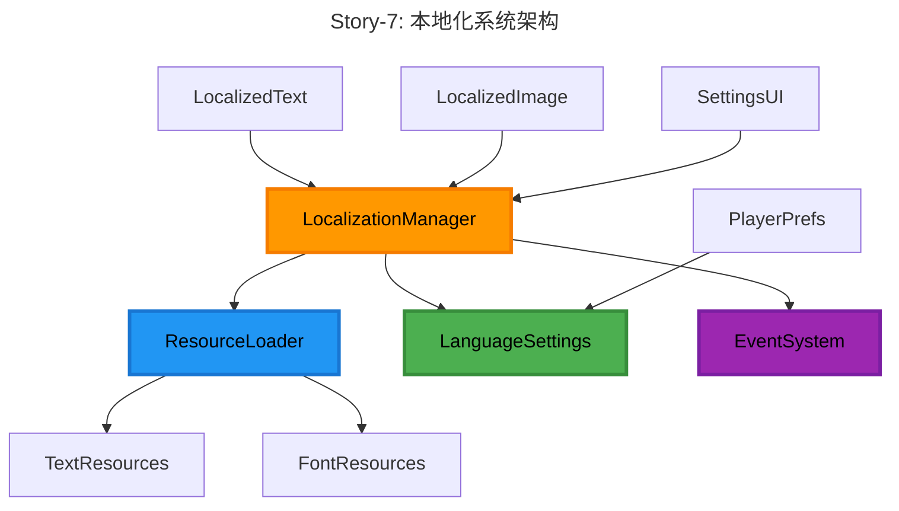

# Epic-2: 桌面菜单 UI 系统

# Story-7: 菜单UI系统的本地化支持

## Story

**As a** 不同语言环境的VR乒乓球游戏玩家
**I want** 能够以我熟悉的语言查看游戏菜单和界面
**so that** 我可以更容易地理解和使用游戏功能，获得更好的游戏体验

## Status

In Progress

## Context

在Epic-2的Story-6中，我们已经完成了桌面菜单UI布局和交互系统的设计与实现。现在，我们需要为菜单UI系统添加本地化支持，使不同语言的玩家都能够以自己熟悉的语言使用游戏。

目前，游戏界面仅支持单一语言，这限制了游戏的国际化发展。通过添加本地化支持，我们可以扩大游戏的受众群体，提高用户体验，并为未来的国际化发展奠定基础。

技术背景：
- 基于Story-6中开发的菜单UI系统
- 需要支持多语言文本资源加载和切换
- 需要考虑不同语言的文本长度和字体差异
- 需要实现动态的UI布局调整

## Estimation

Story Points: 3

## Tasks

1. - [x] 设计本地化系统架构
   1. - [x] 定义本地化数据结构
   2. - [x] 设计本地化工作流程
   3. - [x] 规划本地化资源管理
   4. - [x] 设计语言切换机制

2. - [x] 创建本地化管理器
   1. - [x] 实现LocalizationManager脚本
   2. - [x] 创建文本资源加载系统
   3. - [x] 实现语言切换功能
   4. - [x] 添加事件通知系统

3. - [x] 更新UI组件以支持本地化
   1. - [x] 创建LocalizedText组件
   2. - [x] 修改现有文本组件
   3. - [x] 实现动态文本大小调整
   4. - [x] 添加字体切换支持

4. - [x] 准备本地化资源
   1. - [x] 创建中文翻译表
   2. - [x] 创建英文翻译表
   3. - [x] 添加字体资源
   4. - [x] 设置默认语言和回退机制

5. - [x] 实现设置菜单中的语言选项
   1. - [x] 创建语言选择界面
   2. - [x] 实现语言选择逻辑
   3. - [x] 保存用户语言偏好
   4. - [x] 添加语言预览功能

6. - [ ] 测试和优化
   1. - [ ] 测试不同语言切换
   2. - [ ] 验证UI布局适应性
   3. - [ ] 优化本地化资源加载性能
   4. - [ ] 处理特殊字符和格式问题

## Constraints

1. **性能要求**:
   - 本地化系统不应显著增加游戏启动时间
   - 语言切换应在1秒内完成
   - 本地化资源加载应异步进行，不阻塞主线程

2. **兼容性要求**:
   - 必须支持中文和英文
   - 系统设计应易于扩展以支持更多语言
   - 需要考虑不同语言的文本长度差异
   - 需要支持不同字体和字符集

3. **用户体验要求**:
   - 语言切换应平滑，无明显闪烁
   - 用户语言偏好应被保存
   - 首次启动应默认使用系统语言
   - 应提供语言预览功能

## Design

### 本地化系统架构



### 本地化工作流程


### 数据结构

1. **本地化键值对**
```json
{
  "menu.title": {
    "en": "Main Menu",
    "zh": "主菜单"
  },
  "settings.language": {
    "en": "Language",
    "zh": "语言"
  }
}
```

2. **语言配置**
```json
{
  "languages": [
    {
      "code": "en",
      "name": "English",
      "font": "LiberationSans",
      "fallback": ""
    },
    {
      "code": "zh",
      "name": "中文",
      "font": "NotoSansSC",
      "fallback": "en"
    }
  ],
  "default": "en"
}
```

## Implementation Details

### 主要类和组件

1. **LocalizationManager**
```csharp
public class LocalizationManager : MonoBehaviour
{
    // 单例实例
    public static LocalizationManager Instance { get; private set; }

    // 当前语言
    public string CurrentLanguage { get; private set; }

    // 可用语言列表
    public List<LanguageInfo> AvailableLanguages { get; private set; }

    // 语言变更事件
    public event Action<string> OnLanguageChanged;

    // 本地化文本资源
    private Dictionary<string, Dictionary<string, string>> m_textResources;

    // 字体资源
    private Dictionary<string, Font> m_fontResources;

    // 初始化本地化系统
    public void Initialize();

    // 加载语言资源
    public IEnumerator LoadLanguageResources(string languageCode);

    // 切换语言
    public void SwitchLanguage(string languageCode);

    // 获取本地化文本
    public string GetLocalizedText(string key, params object[] args);

    // 获取语言字体
    public Font GetLanguageFont(string languageCode);

    // 保存语言设置
    public void SaveLanguagePreference(string languageCode);

    // 加载语言设置
    public string LoadLanguagePreference();
}
```

2. **LocalizedText**
```csharp
public class LocalizedText : MonoBehaviour
{
    // 本地化键
    [SerializeField] private string m_localizationKey;

    // 格式化参数
    [SerializeField] private string[] m_formatArgs;

    // 自动调整字体大小
    [SerializeField] private bool m_autoResizeFont = true;

    // 最小和最大字体大小
    [SerializeField] private float m_minFontSize = 10f;
    [SerializeField] private float m_maxFontSize = 40f;

    // 文本组件引用
    private TextMeshProUGUI m_textComponent;

    // 初始化
    private void Awake();

    // 注册事件
    private void OnEnable();

    // 取消注册事件
    private void OnDisable();

    // 更新本地化文本
    public void UpdateLocalizedText();

    // 设置格式化参数
    public void SetFormatArgs(params string[] args);

    // 调整字体大小
    private void AdjustFontSize();
}
```

3. **LanguageSelector**
```csharp
public class LanguageSelector : MonoBehaviour
{
    // 语言选择下拉菜单
    [SerializeField] private TMP_Dropdown m_languageDropdown;

    // 预览文本
    [SerializeField] private TextMeshProUGUI m_previewText;

    // 预览键
    [SerializeField] private string[] m_previewKeys;

    // 初始化
    private void Start();

    // 更新语言列表
    private void UpdateLanguageList();

    // 处理语言选择
    private void OnLanguageSelected(int index);

    // 更新预览文本
    private void UpdatePreviewText(string languageCode);
}
```

### 资源结构

```
Resources/
├── Localization/
│   ├── Config/
│   │   └── languages.json       // 语言配置
│   ├── Fonts/
│   │   ├── LiberationSans.ttf   // 英文字体
│   │   └── NotoSansSC.ttf       // 中文字体
│   └── Text/
│       ├── en.json              // 英文文本
│       └── zh.json              // 中文文本
```

## Testing Strategy

1. **功能测试**:
   - 验证所有UI文本正确本地化
   - 测试语言切换功能
   - 确认字体正确加载和应用
   - 验证文本格式化功能

2. **兼容性测试**:
   - 测试不同语言下的UI布局
   - 验证长文本自动调整
   - 测试特殊字符显示
   - 确认不同分辨率下的显示效果

3. **性能测试**:
   - 测量本地化资源加载时间
   - 评估语言切换性能
   - 监控内存使用情况
   - 验证启动时间影响

4. **用户体验测试**:
   - 评估语言选择界面的易用性
   - 测试语言预览功能
   - 验证用户语言偏好保存
   - 收集不同语言用户的反馈

## Acceptance Criteria

1. 游戏支持中文和英文两种语言
2. 所有UI文本元素都正确显示本地化内容
3. 用户可以在设置菜单中轻松切换语言
4. 语言切换平滑，无明显闪烁或布局问题
5. 用户语言偏好被正确保存和加载
6. 首次启动时默认使用系统语言（如可用）
7. 本地化系统不显著影响游戏性能
8. 本地化系统设计易于扩展以支持更多语言

## References

- [Unity本地化最佳实践](https://unity.com/how-to/localization-best-practices)
- [TextMesh Pro文档](https://docs.unity3d.com/Manual/com.unity.textmeshpro.html)
- [国际化和本地化指南](https://www.w3.org/International/questions/qa-i18n)
- Epic-2 Story-6 桌面菜单UI布局和交互文档