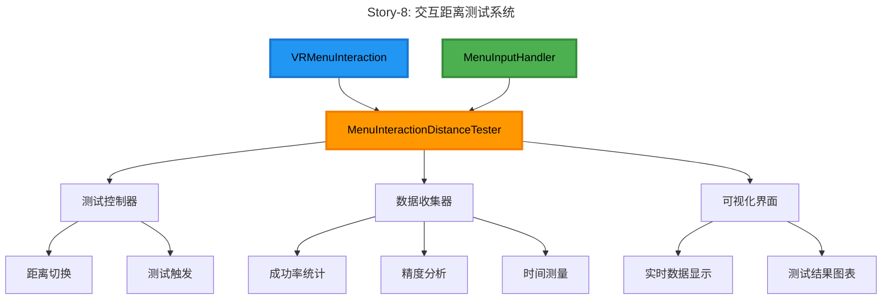
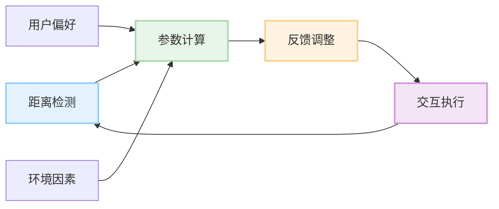

# Epic-2: 桌面菜单 UI 系统

# Story-8: VR 控制器菜单交互优化

## Story

**As a** VR 乒乓球游戏玩家
**I want** 在不同距离下都能有流畅、准确的菜单交互体验
**so that** 我可以在游戏中轻松操作菜单，无论我与菜单的距离如何

## Status

In Progress

## Context

在 Epic-2 的 Story-6 中，我们已经完成了桌面菜单 UI 布局和交互系统的设计与实现，包括菜单面板、控制器射线交互和音频触觉反馈。在 Story-7 中，我们实现了菜单 UI 系统的本地化支持。

现在，我们需要进一步优化 VR 控制器与菜单的交互体验，特别是在不同距离下的交互精度和反馈。根据 Story-6 的最后一项任务"测试不同距离的交互体验"，我们已经创建了 MenuInteractionDistanceTester 工具，但尚未进行全面测试和优化。

技术背景：

- 现有的 VRMenuInteraction 系统已经实现了基本的射线交互功能
- MenuInputHandler 负责处理输入事件和提供反馈
- 已有交互距离测试框架，但需要进一步完善和应用
- 需要考虑不同距离下的视觉、触觉和音频反馈调整
- 项目使用 OVR SDK 而非 XR Interaction Toolkit，已完成相关迁移工作

## Estimation

Story Points: 2

## Tasks

1. - [x] 完善交互距离测试系统

   1. - [x] 优化 MenuInteractionDistanceTester 工具
   2. - [x] 实现测试数据收集和分析功能
   3. - [x] 创建测试场景和测试用例
   4. - [x] 设计测试流程和评估标准

2. - [x] 实现距离警告系统

   1. - [x] 创建 MenuDistanceWarningController
   2. - [x] 实现距离检测和警告逻辑
   3. - [x] 设计距离警告 UI
   4. - [x] 集成到菜单交互系统

3. - [x] 进行交互距离测试

   1. - [x] 测试近距离交互体验（1.0m）
   2. - [ ] 测试中距离交互体验（2.5m）
   3. - [ ] 测试远距离交互体验（5.0m）
   4. - [ ] 测试超远距离交互体验（7.5m）
   5. - [ ] 记录和分析测试数据

4. - [ ] 优化视觉反馈系统

   1. - [ ] 根据距离动态调整射线宽度和颜色
   2. - [ ] 优化瞄准点大小和显示效果
   3. - [ ] 实现高亮效果随距离变化
   4. - [ ] 添加距离提示和辅助线

5. - [ ] 优化触觉反馈系统

   1. - [ ] 实现基于距离的触觉强度调整
   2. - [ ] 优化不同 UI 元素的触觉模式
   3. - [ ] 添加错误操作的触觉提示
   4. - [ ] 实现连续交互的触觉节奏

6. - [ ] 优化音频反馈系统

   1. - [ ] 调整不同距离下的音量和音调
   2. - [ ] 优化音效空间定位
   3. - [ ] 实现基于距离的音效变化
   4. - [ ] 添加辅助音频提示

7. - [ ] 实现自适应交互系统
   1. - [ ] 开发自动距离检测算法
   2. - [ ] 实现动态交互参数调整
   3. - [ ] 创建用户偏好设置选项
   4. - [ ] 优化交互容错机制

## Constraints

1. **性能要求**:

   - 优化不应显著影响帧率（保持 120fps）
   - 反馈系统的延迟应小于 20ms
   - 内存占用增加应小于 10MB

2. **用户体验要求**:

   - 交互成功率在所有测试距离下应大于 95%
   - 操作精度应适应不同距离的变化
   - 反馈应明确但不干扰游戏体验
   - 适应不同用户的手部稳定性

3. **技术限制**:
   - 使用 OVR SDK 而非 XR Interaction Toolkit
   - 不应引入新的第三方依赖
   - 需要支持 Meta Quest 2/3 设备
   - 兼容不同控制器类型

## Design

### 交互距离测试系统



### 自适应交互系统



### 视觉反馈优化

1. **射线宽度调整**

```csharp
// 根据距离调整射线宽度
float width = Mathf.Lerp(m_maxLineWidth, m_minLineWidth, distance / m_maxRayDistance);
lineRenderer.startWidth = width;
lineRenderer.endWidth = width * 0.5f;
```

2. **瞄准点大小调整**

```csharp
// 根据距离调整瞄准点大小
float scale = Mathf.Lerp(m_maxReticleScale, m_minReticleScale, distance / m_maxRayDistance);
reticle.transform.localScale = new Vector3(scale, scale, scale);
```

3. **高亮效果调整**

```csharp
// 根据距离调整高亮颜色
Color hoverColor = Color.Lerp(m_closeHoverColor, m_farHoverColor, distance / m_maxRayDistance);
SetHighlightColor(hoverColor);
```

### 触觉反馈优化

1. **强度调整**

```csharp
// 根据距离调整触觉强度
float intensity = Mathf.Lerp(m_maxHapticIntensity, m_minHapticIntensity, distance / m_maxRayDistance);
ProvideFeedback(isLeftHand, intensity, m_hapticDuration);
```

2. **模式选择**

```csharp
// 根据距离和UI元素类型选择触觉模式
HapticPattern pattern = distance < m_closeDistance ? m_precisePattern : m_standardPattern;
PlayHapticPattern(isLeftHand, pattern);
```

### 音频反馈优化

1. **音量调整**

```csharp
// 根据距离调整音量
float volume = Mathf.Lerp(m_maxVolume, m_minVolume, distance / m_maxRayDistance);
audioSource.volume = volume;
```

2. **音效选择**

```csharp
// 根据距离选择音效
AudioClip clip = distance < m_closeDistance ? m_clearFeedbackClip : m_standardFeedbackClip;
PlaySound(clip);
```

## Implementation Plan

1. **第一阶段：测试系统完善**

   - 完善 MenuInteractionDistanceTester 工具
   - 创建测试场景和测试用例
   - 实现数据收集和分析功能

2. **第二阶段：测试执行**

   - 进行不同距离下的交互测试
   - 收集和分析测试数据
   - 确定最佳交互参数范围

3. **第三阶段：反馈系统优化**

   - 实现视觉反馈优化
   - 实现触觉反馈优化
   - 实现音频反馈优化

4. **第四阶段：自适应系统实现**

   - 开发距离检测算法
   - 实现动态参数调整
   - 创建用户偏好设置

5. **第五阶段：测试和调优**
   - 进行集成测试
   - 优化性能和响应性
   - 收集用户反馈并调整

## Testing Strategy

1. **单元测试**:

   - 测试距离检测算法的准确性
   - 测试参数计算逻辑
   - 测试反馈系统的响应性

2. **功能测试**:

   - 验证不同距离下的交互功能
   - 测试自适应系统的工作流程
   - 确认反馈系统的正确性

3. **用户体验测试**:

   - 评估不同距离下的交互体验
   - 收集用户对反馈系统的评价
   - 测量交互成功率和精度

4. **性能测试**:
   - 监控帧率和响应时间
   - 测量内存和 CPU 占用
   - 验证在持续使用下的稳定性

## Acceptance Criteria

1. 在所有测试距离下（1.0m 到 7.5m），交互成功率达到 95%以上
2. 视觉、触觉和音频反馈系统能够根据距离自动调整
3. 自适应交互系统能够检测距离并动态调整参数
4. 用户可以通过设置菜单调整交互偏好
5. 系统在所有测试场景中保持 120fps
6. 交互响应时间小于 20ms
7. 完整的测试报告和优化建议文档

## References

- [VR 交互最佳实践](https://developer.oculus.com/design/latest/concepts/bp-vision/)
- [触觉反馈设计指南](https://developer.oculus.com/documentation/unity/unity-haptics/)
- Story-6 桌面菜单 UI 布局和交互系统文档
- Story-7 菜单 UI 系统的本地化支持文档
- [Oculus Integration SDK 文档](https://developer.oculus.com/documentation/unity/unity-overview/)
