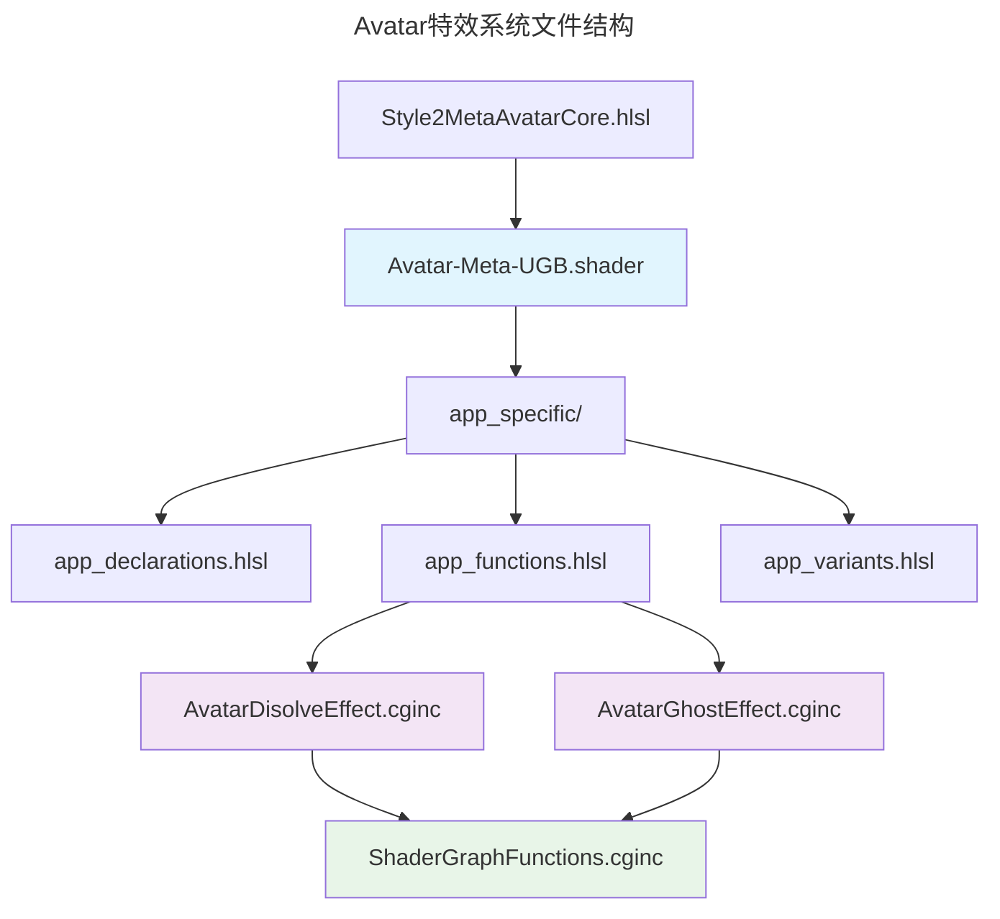

# 自定义Avatar系统

本文档详细说明了我们如何为游戏集成自定义Avatar特效系统。

## 概述

为了在Avatar上集成自定义特效，我们需要复制并修改以下核心文件：
- `Style-2-Avatar-Meta.shader`
- `Style2MetaAvatarCore.hlsl`

## 核心文件说明

### Avatar-Meta-UGB.shader

[Avatar-Meta-UGB.shader](./Avatar-Meta-UGB.shader) 是来自包的 `Style-2-Avatar-Meta` 的副本。我们需要这个副本是因为相对路径到 `app_specific` 实现和额外的着色器属性。

该着色器包含以下关键目录结构：
- [app_specific](./app_specific) 目录
  - [app_declarations.hlsl](./app_specific/app_declarations.hlsl) - 声明文件
  - [app_functions.hlsl](./app_specific/app_functions.hlsl) - 功能函数
  - [app_variants.hlsl](./app_specific/app_variants.hlsl) - 变体定义

> 💡 **重要:** [app_functions.hlsl](./app_specific/app_functions.hlsl) 是我们插入以下特效调用的关键文件：
> - [AvatarDisolveEffect.cginc](./AvatarDisolveEffect.cginc)
> - [AvatarGhostEffect.cginc](./AvatarGhostEffect.cginc)

我们还更新了着色器中的属性列表，以便能够从材质中自定义这两种特效。

### Style2MetaAvatarCore.hlsl

[Style2MetaAvatarCore.hlsl](./Style2MetaAvatarCore.hlsl) 是包中文件的副本。对于幽灵特效，我们需要获取屏幕位置，但原始文件中没有提供，所以我们需要包含它。

## 修改标记

为了便于将来的更新，我们将所有对原始文件的修改都用注释包装起来：

```hlsl
// MOD START Ultimate-Gloveball: {修改描述}
{修改内容}
// MOD END Ultimate-Gloveball
```

> ℹ️ **注意:** 这种标记方式可以帮助我们在未来更新时快速识别和保留自定义修改。

## 特效系统

### 溶解特效 (Dissolve Effect)

溶解特效在 [AvatarDisolveEffect.cginc](./AvatarDisolveEffect.cginc) 中实现。

**用途:** 玩家生成和消失时应用的特效

**特点:**
- 平滑的溶解过渡
- 可自定义溶解参数
- 支持Alpha裁剪

### 幽灵特效 (Ghost Effect)

幽灵特效在 [AvatarGhostEffect.cginc](./AvatarGhostEffect.cginc) 中实现。

**用途:** 当用户处于无敌状态时应用的特效，包括：
- 生成后的无敌时间
- 持有幽灵球时的状态

**特点:**
- 半透明效果
- 屏幕空间扭曲
- 动态变化效果

### Shader Graph 函数

特效使用 Shader Graph 生成，并使用了 [ShaderGraphFunctions.cginc](ShaderGraphFunctions.cginc) 中包含的特定函数，这样就与 Shader Graph 本身解耦。

**优势:**
- 模块化设计
- 独立于 Shader Graph
- 便于维护和更新

### Alpha 裁剪技术

由于我们不想对Avatar使用透明度，所以使用裁剪技术在网格中生成孔洞，并保持在不透明层上。

这个功能在 [app_functions.hlsl](./app_specific/app_functions.hlsl) 中为两种特效都进行了集成。

**技术特点:**
- 保持渲染性能
- 避免透明度排序问题
- 支持复杂的裁剪模式

## 文件结构图



> 🚨 **重要提醒:** 在更新原始包文件时，请务必检查并保留所有标记为 "MOD START/END Ultimate-Gloveball" 的自定义修改。
