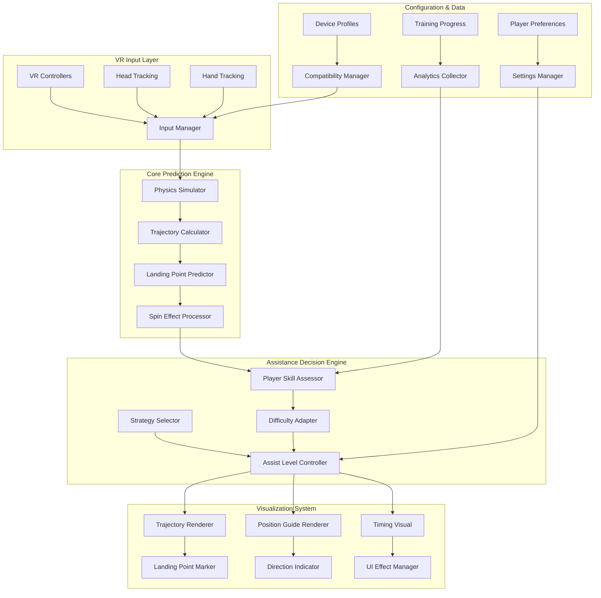
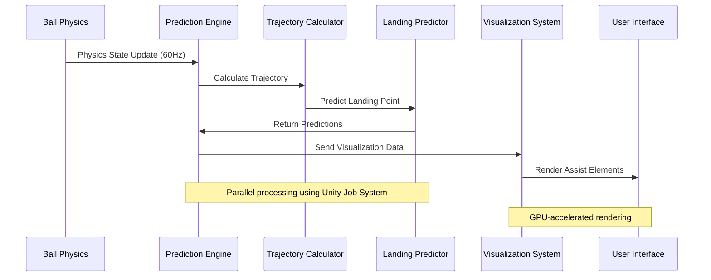
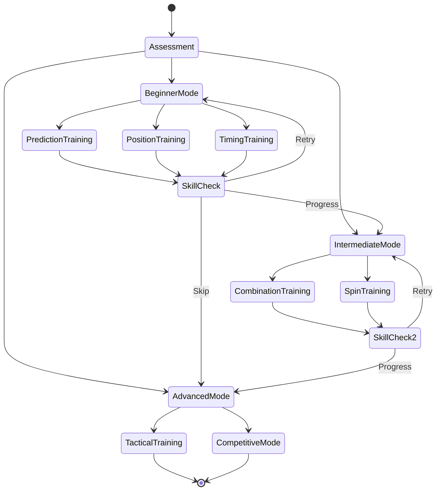

# Architecture for Target Assist Training System

## Status: Draft

## Technical Summary

Target Assist Training System (TATS) 采用模块化、高性能的架构设计，核心组件包括物理预测引擎、实时可视化渲染器、智能辅助决策系统和自适应配置管理器。系统基于 Unity 引擎构建，充分利用 GPU 并行计算能力，确保在 120fps VR 环境下提供<10ms 延迟的实时辅助体验。

架构遵循单一职责原则，每个模块专注特定功能领域，通过事件驱动的松耦合设计确保系统的可扩展性和可维护性。预测引擎基于高精度物理模拟，可视化系统采用 GPU 加速渲染，决策系统支持机器学习算法集成，配置系统提供实时的个性化调节能力。

## Technology Table

| Technology                      | Description                                    |
| ------------------------------- | ---------------------------------------------- |
| Unity 2022.3 LTS                | 主游戏引擎，提供物理计算、渲染管线和 VR 集成   |
| Unity Physics                   | 自定义物理引擎，处理乒乓球特殊的旋转和反弹特性 |
| Burst Compiler                  | 高性能 C#代码编译器，用于预测算法优化          |
| Job System                      | Unity 多线程作业系统，并行处理预测计算         |
| Universal Render Pipeline (URP) | 高性能渲染管线，支持 VR 优化和自定义 Shader    |
| Shader Graph                    | 可视化 Shader 编辑器，用于创建辅助可视化效果   |
| DOTween Pro                     | 高性能动画系统，处理平滑的视觉过渡效果         |
| XR Interaction Toolkit          | VR 交互框架，处理控制器输入和空间追踪          |
| Unity Netcode for GameObjects   | 网络同步框架（用于多人训练模式）               |
| TextMeshPro                     | 高质量文本渲染，支持多语言和动态内容           |
| Unity Analytics                 | 数据收集和分析，用于系统优化和用户行为研究     |
| Addressable Assets              | 资源管理系统，支持动态加载和内存优化           |

## Architectural Diagrams

### System Overview



### Prediction Engine Data Flow



### Training Mode State Machine



## Data Models

### Ball Physics State

```csharp
[System.Serializable]
public struct BallPhysicsState
{
    public Vector3 position;           // 球的3D位置
    public Vector3 velocity;           // 球的速度向量
    public Vector3 angularVelocity;    // 角速度（旋转）
    public float mass;                 // 球的质量
    public float radius;               // 球的半径
    public float bounciness;           // 弹性系数
    public float airResistance;        // 空气阻力系数
    public float spinDecay;            // 旋转衰减系数
    public float timestamp;            // 时间戳
}
```

### Trajectory Prediction Result

```csharp
[System.Serializable]
public struct TrajectoryPrediction
{
    public Vector3[] trajectoryPoints;     // 轨迹点数组
    public Vector3 predictedLandingPoint;  // 预测落点
    public float landingTime;              // 到达时间
    public Vector3 bounceVelocity;         // 反弹后速度
    public float confidence;               // 预测置信度
    public bool willBounceOnTable;         // 是否会在球台反弹
    public bool willGoOutOfBounds;         // 是否出界
    public SpinEffect spinEffect;          // 旋转影响效果
}
```

### Player Skill Assessment

```csharp
[System.Serializable]
public class PlayerSkillData
{
    public string playerId;                    // 玩家ID
    public SkillLevel overallLevel;            // 整体技能等级
    public float predictionAccuracy;           // 预判准确率
    public float positioningScore;             // 站位得分
    public float timingConsistency;            // 时机一致性
    public float returnAccuracy;               // 回球准确率
    public Dictionary<TrainingMode, float> modeProgression; // 各模式进度
    public DateTime lastAssessment;            // 最后评估时间
    public int totalTrainingMinutes;           // 总训练时间
    public List<SkillMilestone> achievements;  // 已达成的里程碑
}
```

### Assist Configuration

```csharp
[System.Serializable]
public class AssistConfiguration
{
    // 可视化设置
    public bool showTrajectoryLine;            // 显示轨迹线
    public bool showLandingMarker;             // 显示落点标记
    public bool showPositionGuide;             // 显示站位引导
    public bool showDirectionIndicator;        // 显示方向指示
    public bool showTimingIndicator;           // 显示时机指示

    // 辅助强度设置
    [Range(0f, 1f)] public float predictionOpacity;      // 预测透明度
    [Range(0f, 1f)] public float guidanceStrength;       // 引导强度
    [Range(0f, 0.3f)] public float inputCorrection;      // 输入修正程度

    // 视觉样式设置
    public Color trajectoryColor;              // 轨迹颜色
    public Color landingMarkerColor;           // 落点标记颜色
    public Color safeZoneColor;                // 安全区颜色
    public Color dangerZoneColor;              // 危险区颜色

    // 自适应设置
    public bool enableAdaptiveDifficulty;      // 启用自适应难度
    public float adaptationSpeed;              // 适应速度
    public SkillLevel minimumAssistLevel;      // 最低辅助等级
    public SkillLevel targetSkillLevel;        // 目标技能等级
}
```

## Project Structure

```
Assets/PongHub/Scripts/TargetAssist/
├── Core/
│   ├── TATSManager.cs                    # 主管理器，统筹所有子系统
│   ├── TATSConfig.cs                     # 配置管理和序列化
│   └── TATSEvents.cs                     # 事件定义和消息传递
├── Prediction/
│   ├── PhysicsSimulator.cs               # 高精度物理模拟器
│   ├── TrajectoryCalculator.cs           # 轨迹计算引擎
│   ├── LandingPredictor.cs               # 落点预测算法
│   ├── SpinEffectProcessor.cs            # 旋转效应处理器
│   └── PredictionJobs.cs                 # Unity Job System作业
├── Visualization/
│   ├── TrajectoryRenderer.cs             # 轨迹线渲染器
│   ├── LandingMarkerRenderer.cs          # 落点标记渲染器
│   ├── PositionGuideRenderer.cs          # 站位引导渲染器
│   ├── DirectionIndicatorRenderer.cs     # 方向指示渲染器
│   ├── TimingVisualRenderer.cs           # 时机视觉渲染器
│   └── Shaders/                          # 自定义着色器
│       ├── TrajectoryLine.shadergraph
│       ├── PulsingMarker.shadergraph
│       └── GradientIndicator.shadergraph
├── Training/
│   ├── TrainingModeManager.cs            # 训练模式管理器
│   ├── SkillAssessment.cs                # 技能评估系统
│   ├── DifficultyAdapter.cs              # 难度自适应系统
│   ├── ProgressTracker.cs                # 进度跟踪系统
│   └── TrainingModes/                    # 各种训练模式
│       ├── BeginnerTrainingMode.cs
│       ├── IntermediateTrainingMode.cs
│       └── AdvancedTrainingMode.cs
├── Input/
│   ├── TATSInputProcessor.cs             # 输入处理和修正
│   ├── GestureRecognizer.cs              # 手势识别
│   └── InputCorrection.cs                # 输入修正算法
├── Analytics/
│   ├── PerformanceMonitor.cs             # 性能监控
│   ├── UsageAnalytics.cs                 # 使用情况分析
│   └── UserBehaviorTracker.cs            # 用户行为追踪
└── UI/
    ├── TATSSettingsPanel.cs              # 设置面板UI
    ├── ProgressDisplay.cs                # 进度显示UI
    └── TutorialOverlay.cs                # 教程覆盖UI

Assets/PongHub/Prefabs/TargetAssist/
├── TATS_Manager.prefab                   # 主系统预制件
├── Visualization/                        # 可视化元素预制件
│   ├── TrajectoryLine.prefab
│   ├── LandingMarker.prefab
│   ├── PositionGuide.prefab
│   └── DirectionIndicator.prefab
└── UI/                                   # UI预制件
    ├── TATSSettings.prefab
    └── ProgressHUD.prefab

Assets/PongHub/Materials/TargetAssist/    # 材质和纹理资源
Assets/PongHub/Audio/TargetAssist/        # 音效资源
Assets/PongHub/Data/TargetAssist/         # 配置和数据文件
```

## Key Algorithms

### 1. High-Precision Trajectory Prediction

```csharp
// 使用Runge-Kutta 4阶算法进行高精度积分
public Vector3[] PredictTrajectory(BallPhysicsState initialState, float duration, int steps)
{
    Vector3[] points = new Vector3[steps];
    float dt = duration / steps;

    BallPhysicsState state = initialState;

    for (int i = 0; i < steps; i++)
    {
        points[i] = state.position;

        // RK4 积分计算下一个状态
        Vector3 k1_v = CalculateAcceleration(state) * dt;
        Vector3 k1_p = state.velocity * dt;

        BallPhysicsState state2 = state;
        state2.velocity += k1_v * 0.5f;
        state2.position += k1_p * 0.5f;

        Vector3 k2_v = CalculateAcceleration(state2) * dt;
        Vector3 k2_p = state2.velocity * dt;

        // ... 继续RK4计算

        state.velocity += (k1_v + 2*k2_v + 2*k3_v + k4_v) / 6f;
        state.position += (k1_p + 2*k2_p + 2*k3_p + k4_p) / 6f;
    }

    return points;
}
```

### 2. Spin Effect Calculation

```csharp
// 计算旋转对球反弹的影响（Magnus效应）
public Vector3 CalculateMagnusForce(Vector3 velocity, Vector3 angularVelocity)
{
    // Magnus力 = ρ * V * (ω × v) * 系数
    Vector3 crossProduct = Vector3.Cross(angularVelocity, velocity);
    float magnusCoefficient = 0.1f; // 根据实验数据调整
    return airDensity * velocity.magnitude * crossProduct * magnusCoefficient;
}

public Vector3 CalculateBounceWithSpin(Vector3 incidentVelocity, Vector3 normal, Vector3 angularVelocity)
{
    // 基础反弹计算
    Vector3 baseReflection = Vector3.Reflect(incidentVelocity, normal);

    // 旋转影响反弹角度
    Vector3 spinInfluence = Vector3.Cross(angularVelocity, normal) * spinInfluenceCoefficient;

    return baseReflection + spinInfluence;
}
```

### 3. Adaptive Difficulty Algorithm

```csharp
public float CalculateOptimalAssistLevel(PlayerSkillData skillData, TrainingMode mode)
{
    // 基于玩家技能水平和学习曲线调整辅助强度
    float baseLevel = Mathf.Lerp(1.0f, 0.2f, skillData.overallLevel / 100f);

    // 考虑特定模式的熟练度
    float modeProgress = skillData.modeProgression.GetValueOrDefault(mode, 0f);
    float modeModifier = Mathf.Lerp(1.2f, 0.8f, modeProgress / 100f);

    // 考虑最近表现趋势
    float recentPerformance = CalculateRecentPerformanceTrend(skillData);
    float performanceModifier = Mathf.Lerp(1.1f, 0.9f, recentPerformance);

    return Mathf.Clamp01(baseLevel * modeModifier * performanceModifier);
}
```

## Performance Optimization Strategies

### 1. Prediction Computation Optimization

- **Unity Job System**: 利用多线程并行计算轨迹预测
- **Burst Compiler**: 编译 C#代码为高度优化的原生代码
- **预计算缓存**: 缓存常用的物理常数和查找表
- **LOD 系统**: 根据重要性调整预测精度和更新频率

### 2. Rendering Optimization

- **GPU Instance Rendering**: 批量渲染多个辅助元素
- **Shader 优化**: 自定义轻量级 Shader 减少渲染开销
- **Frustum Culling**: 只渲染视野内的辅助元素
- **动态 LOD**: 根据距离调整视觉效果复杂度

### 3. Memory Management

- **Object Pooling**: 重用可视化组件避免频繁创建销毁
- **Addressable Assets**: 按需加载资源优化内存使用
- **数据压缩**: 使用紧凑的数据结构减少内存占用

## Change Log

| Change               | Story ID | Description                                      |
| -------------------- | -------- | ------------------------------------------------ |
| Initial Architecture | N/A      | Initial draft of TATS system architecture design |

---

**Created**: 2025 年 7 月 15 日  
**Version**: 1.0  
**Authors**: AI Assistant  
**Review Status**: Pending Technical Review
