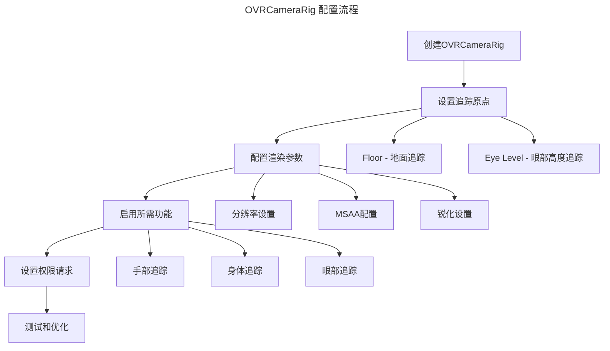

# OVRCameraRig 技术文档

## 概述

OVRCameraRig是Meta (Oculus) VR SDK的核心组件，负责管理VR设备的摄像机、头显和控制器的追踪与渲染。在PongHub项目中，OVRCameraRig被广泛用于玩家移动、高度调整、观众系统和UI交互等功能。

## 项目中的使用现状

### 预制件结构

#### 1. 主要预制件
- **路径**: `Assets/PongHub/Prefabs/App/CameraRig.prefab`
- **用途**: 项目主要的VR摄像机装备
- **特点**: 包含完整的VR交互系统

#### 2. Meta官方预制件
- **路径**: `Packages/com.meta.utilities.input/CameraRig.prefab`
- **用途**: 官方参考实现
- **特点**: 集成了手部追踪和身体追踪功能

## 核心参数配置

### OVRCameraRig组件参数

| 参数名称 | 类型 | 默认值 | 说明 |
|:---------|:-----|:-------|:-----|
| `usePerEyeCameras` | bool | false | 是否使用双眼分别渲染 |
| `useFixedUpdateForTracking` | bool | false | 是否在FixedUpdate中处理追踪 |
| `disableEyeAnchorCameras` | bool | false | 是否禁用眼部锚点摄像机 |

### OVRManager组件参数

| 参数名称 | 类型 | 默认值 | 说明 |
|:---------|:-----|:-------|:-----|
| `useRecommendedMSAALevel` | bool | true | 使用推荐的MSAA级别 |
| `_trackingOriginType` | enum | Floor | 追踪原点类型 |
| `usePositionTracking` | bool | true | 启用位置追踪 |
| `useRotationTracking` | bool | true | 启用旋转追踪 |
| `useIPDInPositionTracking` | bool | true | 在位置追踪中使用IPD |
| `resetTrackerOnLoad` | bool | true | 加载时重置追踪器 |
| `AllowRecenter` | bool | true | 允许重新定位 |
| `LateControllerUpdate` | bool | true | 控制器延迟更新 |
| `LateLatching` | bool | true | 延迟锁定 |

### 渲染相关参数

| 参数名称 | 类型 | 默认值 | 说明 |
|:---------|:-----|:-------|:-----|
| `enableDynamicResolution` | bool | false | 启用动态分辨率 |
| `minRenderScale` | float | 0.7 | 最小渲染比例 |
| `maxRenderScale` | float | 1.0 | 最大渲染比例 |
| `_sharpenType` | enum | 0 | 锐化类型 |
| `_monoscopic` | bool | false | 单眼渲染模式 |

### 权限相关参数

| 参数名称 | 类型 | 默认值 | 说明 |
|:---------|:-----|:-------|:-----|
| `requestBodyTrackingPermissionOnStartup` | bool | true | 启动时请求身体追踪权限 |
| `requestFaceTrackingPermissionOnStartup` | bool | true | 启动时请求面部追踪权限 |
| `requestEyeTrackingPermissionOnStartup` | bool | true | 启动时请求眼部追踪权限 |
| `requestScenePermissionOnStartup` | bool | false | 启动时请求场景权限 |

## 项目中的使用方式

### 1. 玩家移动系统

```csharp
// PlayerMovement.cs
[SerializeField] private OVRCameraRig m_cameraRig;

// 获取头部位置进行移动计算
var headOffset = m_head.position - position;
headOffset.y = 0;
```

> 💡 **实现亮点**: 基于头部位置而不是相机中心点进行移动计算，提供更自然的移动体验。

### 2. 高度调整系统

```csharp
// PlayerHeightController.cs
private Transform m_playerRig; // OVRCameraRig或XR Rig

// 自动查找VR装备
GameObject rig = GameObject.Find("OVRCameraRig") ??
                GameObject.Find("XR Rig") ??
                GameObject.Find("CameraRig");
```

> 💡 **兼容性设计**: 支持多种VR设备类型，提供良好的跨平台兼容性。

### 3. 观众系统

```csharp
// SpectatorNetwork.cs
var cameraRig = FindObjectOfType<OVRCameraRig>();
```

> ℹ️ **注意**: 使用FindObjectOfType可能存在性能问题，建议使用单例模式或依赖注入。

## 配置指南

### 基础配置



### 推荐配置

#### 性能优化配置
```yaml
# 适用于性能要求高的场景
useRecommendedMSAALevel: true
enableDynamicResolution: true
minRenderScale: 0.5
maxRenderScale: 0.8
_sharpenType: 0
```

#### 高质量配置
```yaml
# 适用于画质要求高的场景
useRecommendedMSAALevel: true
enableDynamicResolution: false
minRenderScale: 1.0
maxRenderScale: 1.0
_sharpenType: 1
```

## 最佳实践

### 1. 追踪原点设置

> 🚨 **重要**: 根据应用类型选择合适的追踪原点

- **Floor**: 适用于需要准确地面定位的应用（如PongHub）
- **Eye Level**: 适用于坐式VR体验

### 2. 性能优化

#### 渲染优化
```csharp
// 动态调整渲染比例
if (Application.targetFrameRate < 72) {
    // 降低渲染比例保证帧率
    OVRManager.instance.renderScale = 0.8f;
}
```

#### 追踪优化
```csharp
// 根据需要禁用不必要的追踪功能
OVRManager.instance.usePositionTracking = true;
OVRManager.instance.useRotationTracking = true;
// 如果不需要眼部追踪可以禁用
OVRManager.instance.requestEyeTrackingPermissionOnStartup = false;
```

### 3. 内存管理

```csharp
// 避免频繁调用FindObjectOfType
private static OVRCameraRig s_cameraRigInstance;

public static OVRCameraRig GetCameraRig()
{
    if (s_cameraRigInstance == null)
        s_cameraRigInstance = FindObjectOfType<OVRCameraRig>();
    return s_cameraRigInstance;
}
```

## 常见问题与解决方案

### 1. 追踪丢失问题

**问题**: 头显或控制器追踪丢失
**解决方案**:
```csharp
// 检查追踪状态
if (OVRManager.instance.hasPositionTracking)
{
    // 追踪正常
}
else
{
    // 显示追踪丢失提示
    ShowTrackingLostWarning();
}
```

### 2. 帧率优化

**问题**: 帧率不稳定
**解决方案**:
```csharp
// 启用动态分辨率
OVRManager.instance.enableDynamicResolution = true;
OVRManager.instance.minDynamicResolutionScale = 0.7f;
OVRManager.instance.maxDynamicResolutionScale = 1.0f;
```

### 3. 高度调整问题

**问题**: 玩家高度不准确
**解决方案**:
```csharp
// 使用PlayerHeightController进行精确高度调整
PlayerHeightController.Instance.SetHeightOffset(offsetInMeters);
```

## 优化建议

### 1. 架构优化

#### 单例模式实现
```csharp
public class VRManager : MonoBehaviour
{
    private static VRManager s_instance;
    public static VRManager Instance => s_instance;

    [SerializeField] private OVRCameraRig m_cameraRig;
    public OVRCameraRig CameraRig => m_cameraRig;

    private void Awake()
    {
        if (s_instance == null)
        {
            s_instance = this;
            DontDestroyOnLoad(gameObject);
        }
        else
        {
            Destroy(gameObject);
        }
    }
}
```

#### 依赖注入
```csharp
// 使用依赖注入避免硬编码查找
[System.Serializable]
public class VRDependencies
{
    public OVRCameraRig cameraRig;
    public Transform playerRig;
    public Camera vrCamera;
}
```

### 2. 性能监控

```csharp
public class VRPerformanceMonitor : MonoBehaviour
{
    private float m_frameTime;
    private float m_renderScale;

    private void Update()
    {
        m_frameTime = Time.unscaledDeltaTime;
        m_renderScale = OVRManager.instance.renderScale;

        // 根据性能动态调整
        if (m_frameTime > 1.0f/72.0f) // 低于72fps
        {
            // 降低渲染质量
            AdjustRenderQuality(false);
        }
    }
}
```

### 3. 兼容性增强

```csharp
public static class VRCompatibility
{
    public static Transform FindVRRig()
    {
        // 按优先级查找VR装备
        var candidates = new string[] {
            "OVRCameraRig", "XRRig", "CameraRig",
            "[XR Rig]", "[CameraRig]"
        };

        foreach (var name in candidates)
        {
            var go = GameObject.Find(name);
            if (go != null) return go.transform;
        }

        return null;
    }
}
```

## 调试工具

### 1. 追踪状态显示

```csharp
public class VRDebugOverlay : MonoBehaviour
{
    private void OnGUI()
    {
        GUILayout.Label($"Position Tracking: {OVRManager.instance.hasPositionTracking}");
        GUILayout.Label($"Rotation Tracking: {OVRManager.instance.hasRotationTracking}");
        GUILayout.Label($"Render Scale: {OVRManager.instance.renderScale:F2}");
        GUILayout.Label($"Frame Rate: {1.0f/Time.unscaledDeltaTime:F1} fps");
    }
}
```

### 2. 性能分析器

```csharp
public class VRProfiler : MonoBehaviour
{
    private struct FrameData
    {
        public float frameTime;
        public float renderScale;
        public bool trackingLost;
    }

    private Queue<FrameData> m_frameHistory = new Queue<FrameData>();

    // 收集性能数据用于分析
}
```

## 总结

OVRCameraRig在PongHub项目中扮演核心角色，正确配置和优化对于VR体验至关重要。通过合理的参数设置、架构优化和性能监控，可以确保稳定、流畅的VR体验。

> 💡 **建议**: 定期检查和更新OVR SDK版本，关注Meta官方的最佳实践指南。

---

## 参考文档

- [Meta XR SDK Documentation](https://developers.meta.com/horizon/documentation/unity)
- [OVRCameraRig官方文档](https://developers.meta.com/horizon/documentation/unity/unity-ovrcamerarig/)
- [Unity XR Guidelines](https://docs.unity3d.com/Manual/XR.html)