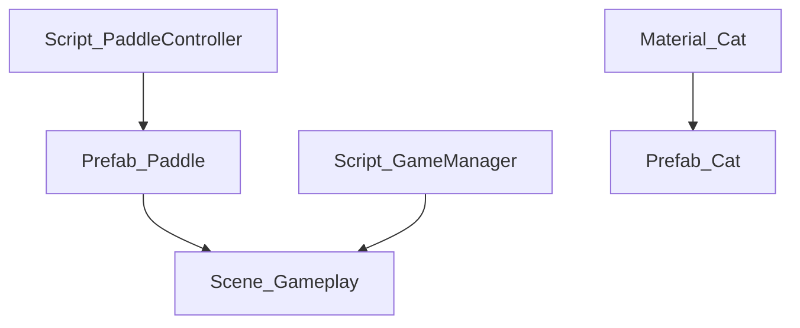

# 功能&资产进度跟踪表

---

## 📋 使用说明
- 本表格用于跟踪项目所有核心功能、资产、接口、进度与任务。
- 每次开发/合并新功能后，**请同步更新本文件并提交到Git仓库**。
- 未完成的功能/接口/资产，请在“TODO链接”列关联到Cursor的TODO任务ID或文档锚点。
- 可用Mermaid语法可视化资产依赖关系。

---

## 1. 功能&资产多维表格

| 资产类型 | 名称/路径 | 关联脚本 | 主要功能 | 方法/接口 | 使用说明 | 实现状态 | TODO链接 | 备注 |
|----------|-----------|----------|----------|-----------|----------|----------|----------|------|
| Script   | Scripts/Input/PaddleController.cs | PaddleController | 球拍控制 | MovePaddle(), SetInput() | 需挂载到Paddle预制体 | ✅ | - | - |
| Prefab   | Prefabs/Paddle.prefab | PaddleController | 玩家球拍 | - | 需与玩家对象绑定 | ⏳ | #TODO-001 | 需完善碰撞反馈 |
| Scene    | Scenes/MainMenu.unity | MainMenuController | 主菜单 | InitMenu() | 入口场景 | ✅ | - | - |
| Material | Materials/Cat.mat | - | 猫角色材质 | - | 绑定到Cat.fbx | ✅ | - | - |

---

## 2. Epic-Story-Task 需求分解

| Epic | Story | Task | 描述 | 状态 | 工时 | 依赖 | TODO链接 |
|------|-------|------|------|------|------|------|----------|
| 多人游戏系统 | 网络同步 | 球物理同步 | 实现球的网络同步 | ✅ | 8h | 物理系统 | - |
| 多人游戏系统 | 网络同步 | 玩家位置同步 | 同步玩家位置 | ⏳ | 4h | 网络框架 | #TODO-002 |

---

## 3. 主要脚本接口表

| 类名 | 方法名 | 功能描述 | 参数 | 返回值 | 实现状态 | 测试覆盖 |
|------|--------|----------|------|--------|----------|----------|
| PaddleController | MovePaddle | 控制球拍移动 | Vector3 dir | void | ✅ | 100% |
| GameManager | StartGame | 开始游戏 | - | void | ⏳ | 80% |

---

## 4. 资产依赖关系（Mermaid可视化）

---

## 5. 进度统计与维护建议
- **实现状态**：✅已完成，⏳进行中，❌未开始
- **TODO链接**：可直接关联到Cursor的TODO任务ID或文档锚点
- **每次开发/合并新功能后**，请同步更新本文件
- **如需批量生成/更新表格**，可用自动化脚本辅助（如需脚本请联系AI助手）

---

*本文件为项目功能跟踪与进度管理的核心文档，后续可根据实际需求扩展表格字段与可视化内容。*