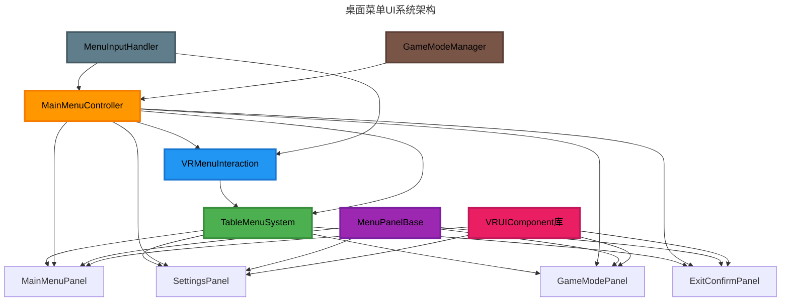
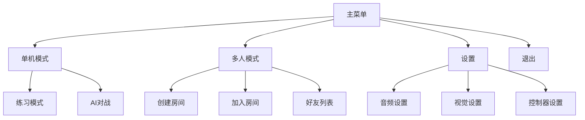
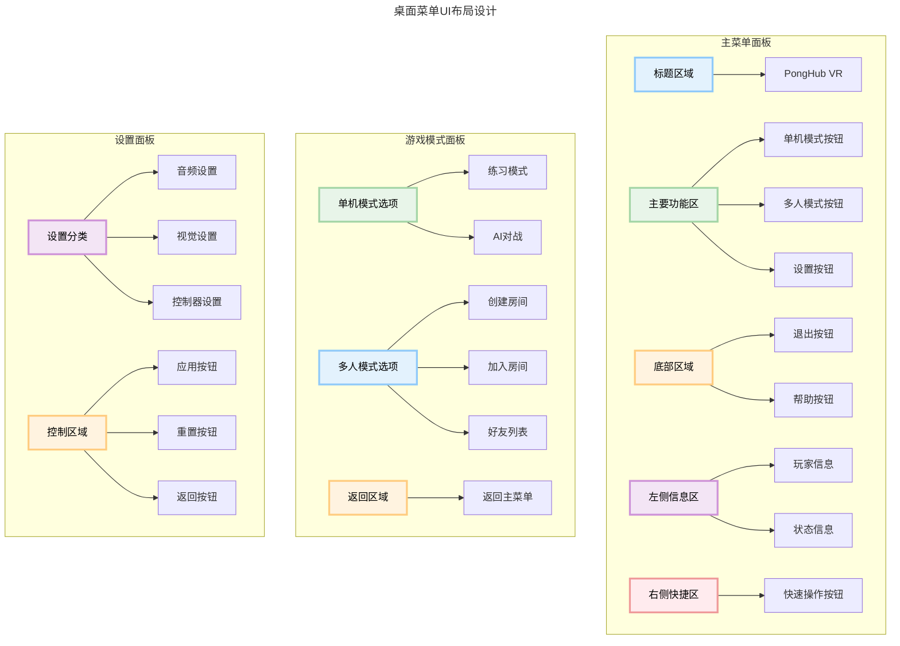

# PongHub VR 菜单系统设计文档

## 概述

本文档详细描述了PongHub VR乒乓球游戏的桌面菜单UI系统设计。该菜单系统平铺在球桌表面上，为玩家提供游戏模式选择、设置调整和其他功能，专为VR环境设计，确保直观的交互体验和清晰的视觉呈现。

## 系统架构

### 组件关系图

### 核心组件说明

1. **TableMenuSystem**
   - 负责菜单在球桌表面的定位和显示
   - 管理菜单的整体布局和缩放
   - 处理菜单与物理环境的交互

2. **VRMenuInteraction**
   - 处理VR控制器与菜单的交互
   - 实现射线指向和点击功能
   - 提供触觉和音频反馈

3. **MainMenuController**
   - 菜单系统的核心控制器
   - 管理不同面板之间的切换
   - 与GameModeManager交互，处理游戏模式切换

4. **MenuPanelBase**
   - 所有菜单面板的基类
   - 提供通用的显示/隐藏动画
   - 定义面板的基本行为和接口

5. **MenuInputHandler**
   - 处理菜单相关的输入事件
   - 转发输入到相应的处理器
   - 管理输入状态和上下文

## 菜单结构

### 菜单层次结构

### UI布局设计

## 菜单面板详细设计

### 主菜单面板 (MainMenuPanel)

主菜单是玩家进入游戏后首先看到的界面，提供对游戏主要功能的访问。

**布局区域**:
- **标题区域**: 显示游戏标题和版本信息
- **主要功能区**: 包含主要功能按钮（单机模式、多人模式、设置）
- **底部区域**: 包含辅助功能按钮（退出、帮助）
- **左侧信息区**: 显示玩家信息和状态
- **右侧快捷区**: 提供快速操作按钮

**交互元素**:
- 大尺寸按钮，适合VR控制器精度
- 悬停效果，提供视觉反馈
- 点击音效和触觉反馈

### 游戏模式面板 (GameModePanel)

游戏模式面板允许玩家选择不同的游戏模式和设置。

**布局区域**:
- **单机模式区域**: 包含练习模式和AI对战选项
- **多人模式区域**: 包含创建房间、加入房间和好友列表选项
- **返回区域**: 提供返回主菜单的按钮

**交互元素**:
- 模式选择卡片，包含图标和描述
- 难度选择滑块（AI对战）
- 房间列表滚动视图（多人模式）

### 设置面板 (SettingsPanel)

设置面板允许玩家调整游戏的各种设置。

**布局区域**:
- **设置分类区域**: 包含音频、视觉和控制器设置选项
- **设置控制区域**: 包含各种设置的控制元素
- **控制按钮区域**: 包含应用、重置和返回按钮

**交互元素**:
- 滑块控件（音量、亮度等）
- 开关控件（启用/禁用功能）
- 下拉菜单（选择选项）

## 交互设计

### 菜单呼出和隐藏

1. **呼出方式**:
   - 按下控制器Menu按钮
   - 在球桌特定区域触发手势

2. **呼出动画**:
   - 菜单从球桌表面平滑升起
   - 伴随轻微的音效和粒子效果

3. **隐藏方式**:
   - 再次按下Menu按钮
   - 点击关闭按钮
   - 远离菜单区域

### 导航和交互

1. **指向和选择**:
   - 使用控制器射线指向UI元素
   - 悬停时提供视觉反馈
   - 点击触发器进行选择

2. **面板切换**:
   - 平滑的过渡动画
   - 保持空间一致性
   - 提供返回路径

3. **滚动和拖拽**:
   - 支持列表和面板的滚动
   - 允许拖拽调整滑块和其他控件

### 反馈机制

1. **视觉反馈**:
   - 悬停高亮
   - 点击动画
   - 状态变化指示

2. **音频反馈**:
   - 轻微的点击音效
   - 导航提示音
   - 错误警告音

3. **触觉反馈**:
   - 按钮点击振动
   - 滑块调整振动
   - 错误警告振动

## 视觉设计

### 配色方案

- **主色**: #2196F3（蓝色）- 主要按钮和标题
- **辅助色**: #4CAF50（绿色）- 确认和积极操作
- **警告色**: #FF9800（橙色）- 警告和注意事项
- **错误色**: #F44336（红色）- 错误和删除操作
- **背景色**: #FAFAFA（浅灰色）- 面板背景
- **文本色**: #212121（深灰色）- 主要文本

### 排版

- **标题字体**: 无衬线粗体，32pt
- **主要文本**: 无衬线常规，24pt
- **辅助文本**: 无衬线轻量，20pt
- **按钮文本**: 无衬线中等，28pt

### 图标和图形

- 简洁的线性图标
- 高对比度，确保可见性
- 一致的视觉语言
- 适当的图标大小（最小48x48px）

## 性能考虑

1. **渲染优化**:
   - 使用共享材质
   - 优化UI批处理
   - 减少透明度和后处理效果

2. **交互优化**:
   - 减少射线检测频率
   - 优化碰撞检测
   - 使用事件委托减少更新调用

3. **内存管理**:
   - 预加载常用面板
   - 延迟加载不常用面板
   - 适当释放资源

## 实现计划

1. **基础框架**:
   - 创建MenuPanelBase基类
   - 实现MainMenuController
   - 设置基本交互系统

2. **UI面板**:
   - 实现MainMenuPanel
   - 实现GameModePanel
   - 实现SettingsPanel

3. **交互系统**:
   - 整合TableMenuSystem和VRMenuInteraction
   - 实现菜单导航和面板切换
   - 添加反馈系统

4. **优化和测试**:
   - 性能优化
   - 用户体验测试
   - 兼容性测试

## 参考资料

- [Meta VR UI设计最佳实践](https://developer.oculus.com/design/bp-vision/)
- [Unity UI优化指南](https://unity.com/how-to/optimize-ui-canvas)
- [VR交互设计模式](https://www.uxofvr.com/)