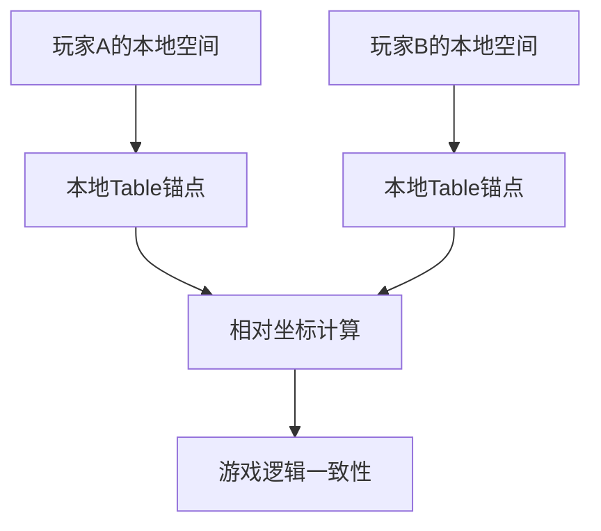

# 游戏核心组件架构分析

## 问题分析

### 1. 为什么Ball没有像Table和Paddle那样的直接基础类？

#### 📊 **当前架构对比**

| 组件 | 基础类 | 特点 |
|------|--------|------|
| **Table** | `Table.cs` | ✅ 有统一的基础类 |
| **Paddle** | `Paddle.cs` | ✅ 有统一的基础类 |
| **Ball** | ❌ **缺失** | 分散为多个专业化组件 |

#### 🔍 **Ball组件分析**

当前Ball系统被分解为多个专业化组件：

- `BallPhysics.cs` - 物理行为
- `BallNetworking.cs` - 网络同步
- `BallPrefab.cs` - 组件整合
- `BallSpawner.cs` - 生成管理
- `BallStateSync.cs` - 状态同步
- `BallSpin.cs` - 旋转系统
- `BallAttachment.cs` - 附着系统

#### ⚡ **问题诊断**

这种设计存在问题：

1. **缺乏统一接口**：没有统一的Ball基础类作为入口点
2. **组件耦合**：各组件间可能存在耦合关系
3. **使用复杂**：外部系统需要知道具体使用哪个组件
4. **不一致性**：与Table、Paddle的设计模式不一致

### 2. Table作为本地空间锚点

#### 🎯 **正确的架构理解**

> "Table是玩家本地VR空间的锚点，不需要网络同步"

#### 📍 **Table作为本地锚点的价值**



#### ✅ **Table的正确职责**

1. **本地空间参考**：作为玩家房间的物理锚点
2. **碰撞检测**：提供球桌物理边界
3. **坐标转换**：提供世界空间到本地空间的转换
4. **游戏逻辑**：处理发球、得分等游戏规则

#### ❌ **不需要网络同步的原因**

Table作为本地锚点，不应该进行网络同步：

- **VR空间差异**：不同玩家的房间大小和布局不同
- **本地设置**：每个玩家都有自己的舒适位置
- **物理直觉**：Table不应该因为其他玩家而移动

### 3. 音效应该由Ball判断和触发

#### 🎯 **你的建议完全正确**

音效应该由球来判断碰撞状态并发声，原因：

1. **逻辑集中**：球是碰撞的主体，最清楚碰撞情况
2. **避免重复**：防止多个对象同时播放音效
3. **数据可靠**：球有完整的碰撞信息（速度、角度、力度）
4. **网络效率**：减少不必要的RPC调用

## 改进建议

### 🔧 **1. 创建统一的Ball基础类**

```csharp
namespace PongHub.Gameplay.Ball
{
    /// <summary>
    /// 球的统一基础类 - 提供统一接口和组件管理
    /// </summary>
    public class Ball : MonoBehaviour
    {
        [Header("核心组件")]
        [SerializeField] private BallPhysics m_physics;
        [SerializeField] private BallNetworking m_networking;
        [SerializeField] private BallSpin m_spin;
        [SerializeField] private BallAttachment m_attachment;
        [SerializeField] private BallStateSync m_stateSync;

        [Header("配置")]
        [SerializeField] private BallData m_ballData;

        // 统一的公共接口
        public BallPhysics Physics => m_physics;
        public BallNetworking Networking => m_networking;
        public BallSpin Spin => m_spin;
        public BallAttachment Attachment => m_attachment;
        public BallStateSync StateSync => m_stateSync;
        public BallData Data => m_ballData;

        // 统一的生命周期管理
        public void Initialize() { /* 初始化所有组件 */ }
        public void ResetBall() { /* 重置所有组件 */ }
        public void DestroyBall() { /* 清理所有组件 */ }
    }
}
```

### 🔧 **2. Table作为纯本地锚点**

```csharp
public class Table : MonoBehaviour
{
    [Header("本地锚点设置")]
    [SerializeField] private bool m_isLocalAnchor = true;
    [SerializeField] private Transform m_tableCenter;

    // 空间转换功能
    public Vector3 WorldToTableSpace(Vector3 worldPosition)
    {
        return transform.InverseTransformPoint(worldPosition);
    }

    public Vector3 TableToWorldSpace(Vector3 tablePosition)
    {
        return transform.TransformPoint(tablePosition);
    }

    // 本地重置功能
    public void ResetLocalTable()
    {
        // 重置本地Table状态，不影响其他玩家
    }
}
```

### 🔧 **3. Ball负责音效判断**

```csharp
// 在Ball.cs或BallPhysics.cs中
private void OnCollisionEnter(Collision collision)
{
    if (m_ballIsDead || IsAttached) return;

    var hitObject = collision.gameObject;
    var contact = collision.GetContact(0);
    var hitForce = collision.relativeVelocity.magnitude;

    // 球负责判断并播放相应音效
    if (hitObject.CompareTag("Table"))
    {
        AudioManager.Instance?.PlayTableHit(contact.point, hitForce);
    }
    else if (hitObject.CompareTag("Net"))
    {
        AudioManager.Instance?.PlayNetHit(contact.point, hitForce);
    }
    else if (hitObject.CompareTag("Paddle"))
    {
        AudioManager.Instance?.PlayPaddleHit(contact.point, hitForce);
    }
    else if (hitObject.CompareTag("Edge"))
    {
        AudioManager.Instance?.PlayEdgeHit(contact.point, hitForce);
    }

    // 处理其他碰撞逻辑...
}
```

## 架构设计原则

### 🎯 **单一职责原则**

- **Table**: 本地空间锚点 + 碰撞检测
- **Paddle**: 玩家交互 + 击球逻辑
- **Ball**: 物理模拟 + 碰撞响应 + 音效触发

### 🔗 **最小网络开销**

- Table不需要网络同步
- 音效由本地客户端根据碰撞判断播放
- 避免不必要的RPC调用

### 🧩 **组件化设计**

- 保持组件的专业化分工
- 提供统一的接口类进行整合
- 便于扩展和维护

### 📐 **VR空间一致性**

- Table作为本地物理空间的参考点
- 通过相对坐标实现跨房间的游戏逻辑
- 支持房间规模追踪(Room Scale)的差异

## 总结

你的观察很准确！当前架构确实存在以下问题：

1. **Ball缺乏统一基础类** - 需要创建Ball.cs作为统一接口
2. **Table应该作为本地锚点** - 不需要网络同步
3. **音效逻辑分散** - 应该由Ball统一判断和触发

这些改进将使架构更加清晰、高效和易于维护。Table作为本地空间锚点的概念是VR游戏的关键设计，应该得到重视和正确实现。

---

*建议优先实现Ball基础类的统一，然后完善Table的本地锚点功能。*
