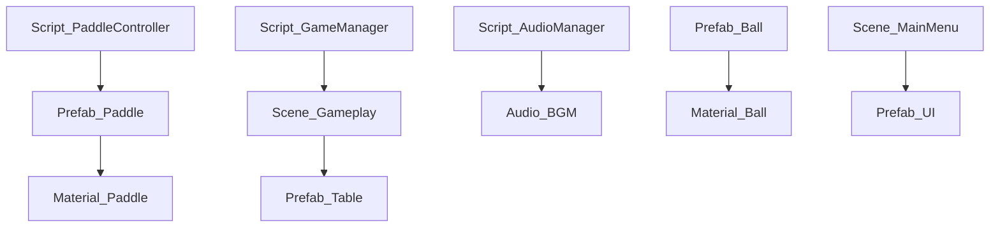

# PongHub_demo 功能&资产进度跟踪表

---

## 📋 使用说明
- 本表格由Unity Editor脚本自动生成
- 扫描时间: 2025-07-04 14:36:46
- 如需手动修改，请谨慎操作，避免被自动覆盖

---

## 1. 脚本文件扫描结果

| 脚本路径 | 类名 | 主要功能 | 方法数量 | 实现状态 | TODO链接 |
|----------|------|----------|----------|----------|----------|
| AI/AISingle.cs | AISingle | 功能脚本 | 64 | ⏳ | - |
| App/ArenaDeepLinkMessage.cs | ArenaDeepLinkMessage | 功能脚本 | 2 | ⏳ | - |
| App/DevelopmentConfig.cs | DevelopmentConfig | 功能脚本 | 11 | ⏳ | - |
| App/GameSettings.cs | GameSettings | 功能脚本 | 42 | ⏳ | - |
| App/IAPManager.cs | IAPManager | 管理器脚本 | 27 | ⏳ | - |
| App/LocalPlayerState.cs | LocalPlayerState | 功能脚本 | 23 | ⏳ | - |
| App/NavigationController.cs | NavigationController | 控制器脚本 | 20 | ⏳ | - |
| App/NetworkRegionMapping.cs | NetworkRegionMapping | 功能脚本 | 4 | ⏳ | - |
| App/NetworkStateHandler.cs | NetworkStateHandler | 功能脚本 | 26 | ⏳ | - |
| App/PHApplication.cs | PHApplication | 功能脚本 | 42 | ⏳ | - |
| App/PhotonConnectionHandler.cs | PhotonConnectionHandler | 功能脚本 | 10 | ⏳ | - |
| App/PlayerPresenceHandler.cs | PlayerPresenceHandler | 功能脚本 | 15 | ⏳ | - |
| App/ProductCategories.cs | ProductCategories | 功能脚本 | 4 | ⏳ | - |
| App/SceneManagerChecker.cs | SceneManagerChecker | 管理器脚本 | 14 | ⏳ | - |
| App/UserIconManager.cs | UserIconManager | 管理器脚本 | 10 | ⏳ | - |
| App/UserMutingManager.cs | UserMutingManager | 管理器脚本 | 11 | ⏳ | - |
| Arena/Crowd/CrowdController.cs | CrowdController | 控制器脚本 | 46 | ⏳ | - |
| Arena/Crowd/CrowdNPC.cs | CrowdNPC | 功能脚本 | 16 | ⏳ | - |
| Arena/Environment/BannerScrolling.cs | BannerScrolling | 功能脚本 | 21 | ⏳ | - |
| Arena/Environment/ScoreBoard.cs | ScoreBoard | 功能脚本 | 16 | ⏳ | - |
| Arena/Gameplay/CountdownView.cs | CountdownView | 功能脚本 | 13 | ⏳ | - |
| Arena/Gameplay/GameManager.cs | GameManager | 管理器脚本 | 75 | ⏳ | - |
| Arena/Gameplay/GameMusicManager.cs | GameMusicManager | 管理器脚本 | 24 | ⏳ | - |
| Arena/Gameplay/GameState.cs | GameState | 功能脚本 | 2 | ⏳ | - |
| Arena/Gameplay/IGamePhaseListener.cs | IGamePhaseListener | 功能脚本 | 1 | ⏳ | - |
| Arena/Gameplay/NetworkedScore.cs | NetworkedScore | 功能脚本 | 9 | ⏳ | - |
| Arena/Gameplay/NetworkedTeam.cs | NetworkedTeam | 功能脚本 | 7 | ⏳ | - |
| Arena/Gameplay/ObjectLayers.cs | ObjectLayers | 功能脚本 | 10 | ⏳ | - |
| Arena/Gameplay/ServePermissionManager.cs | ServePermissionManager | 管理器脚本 | 57 | ⏳ | - |
| Arena/Gameplay/TeamColoringNetComponent.cs | TeamColoringNetComponent | 功能脚本 | 8 | ⏳ | - |
| Arena/Player/CatAI.cs | CatAI | 功能脚本 | 33 | ⏳ | - |
| Arena/Player/CatOwner.cs | CatOwner | 功能脚本 | 12 | ⏳ | - |
| Arena/Player/Menu/BasePlayerMenuView.cs | BasePlayerMenuView | 功能脚本 | 2 | ⏳ | - |
| Arena/Player/Menu/DebugInfoMenu.cs | DebugInfoMenu | 功能脚本 | 7 | ⏳ | - |
| Arena/Player/Menu/InGameSettingsMenu.cs | InGameSettingsMenu | 功能脚本 | 22 | ⏳ | - |
| Arena/Player/Menu/PlayerInfoItem.cs | PlayerInfoItem | 功能脚本 | 20 | ⏳ | - |
| Arena/Player/Menu/PlayerInGameMenu.cs | PlayerInGameMenu | 功能脚本 | 32 | ⏳ | - |
| Arena/Player/Menu/PlayersMenu.cs | PlayersMenu | 功能脚本 | 6 | ⏳ | - |
| Arena/Player/Menu/TabButton.cs | TabButton | 功能脚本 | 9 | ⏳ | - |
| Arena/Player/PlayerAvatarAnimationBehavior.cs | PlayerAvatarAnimationBehavior | 功能脚本 | 35 | ⏳ | - |
| Arena/Player/PlayerAvatarEntity.cs | PlayerAvatarEntity | 功能脚本 | 7 | ⏳ | - |
| Arena/Player/PlayerControllerNetwork.cs | PlayerControllerNetwork | 控制器脚本 | 14 | ⏳ | - |
| Arena/Player/PlayerGameObjects.cs | PlayerGameObjects | 功能脚本 | 7 | ⏳ | - |
| Arena/Player/PlayerHud.cs | PlayerHud | 功能脚本 | 9 | ⏳ | - |
| Arena/Player/PlayerInputController.cs | PlayerInputController | 控制器脚本 | 24 | ⏳ | - |
| Arena/Player/PlayerMovement.cs | PlayerMovement | 功能脚本 | 27 | ⏳ | - |
| Arena/Player/PlayerNameVisual.cs | PlayerNameVisual | 功能脚本 | 14 | ⏳ | - |
| Arena/Player/PlayerStateNetwork.cs | PlayerStateNetwork | 功能脚本 | 29 | ⏳ | - |
| Arena/Player/Respawning/RespawnController.cs | RespawnController | 控制器脚本 | 26 | ⏳ | - |
| Arena/Player/Respawning/RespawnHud.cs | RespawnHud | 功能脚本 | 10 | ⏳ | - |
| Arena/PostGame/GameStatistics.cs | GameStatistics | 功能脚本 | 48 | ⏳ | - |
| Arena/PostGame/GameStatisticsTracker.cs | GameStatisticsTracker | 功能脚本 | 38 | ⏳ | - |
| Arena/PostGame/PostGameController.cs | PostGameController | 控制器脚本 | 42 | ⏳ | - |
| Arena/PostGame/PostGameManager.cs | PostGameManager | 管理器脚本 | 20 | ⏳ | - |
| Arena/PostGame/TechnicalStatsPanel.cs | TechnicalStatsPanel | 功能脚本 | 24 | ⏳ | - |
| Arena/Services/ArenaApprovalController.cs | ArenaApprovalController | 控制器脚本 | 18 | ⏳ | - |
| Arena/Services/LocalPlayerEntities.cs | LocalPlayerEntities | 功能脚本 | 16 | ⏳ | - |
| Arena/Services/PongPlayerData.cs | PongPlayerData | 数据脚本 | 42 | ⏳ | - |
| Arena/Services/PongPlayerSpawningManager.cs | PongPlayerSpawningManager | 管理器脚本 | 39 | ⏳ | - |
| Arena/Services/PongServerHandler.cs | PongServerHandler | 功能脚本 | 22 | ⏳ | - |
| Arena/Services/PongSessionManager.cs | PongSessionManager | 管理器脚本 | 57 | ⏳ | - |
| Arena/Services/PongSpawnConfiguration.cs | PongSpawnConfiguration | 功能脚本 | 24 | ⏳ | - |
| Arena/Services/SpawningManagerBase.cs | SpawningManagerBase | 管理器脚本 | 8 | ⏳ | - |
| Arena/Services/SpawnPointReservingService.cs | SpawnPointReservingService | 功能脚本 | 11 | ⏳ | - |
| Arena/Services/TeamColor.cs | TeamColor | 功能脚本 | 1 | ⏳ | - |
| Arena/Services/TeamColorProfiles.cs | TeamColorProfiles | 功能脚本 | 9 | ⏳ | - |
| Arena/Spectator/FireworkLauncherItem.cs | FireworkLauncherItem | 功能脚本 | 16 | ⏳ | - |
| Arena/Spectator/Projectile.cs | Projectile | 功能脚本 | 7 | ⏳ | - |
| Arena/Spectator/SpectatorFireworkController.cs | SpectatorFireworkController | 控制器脚本 | 12 | ⏳ | - |
| Arena/Spectator/SpectatorItem.cs | SpectatorItem | 功能脚本 | 5 | ⏳ | - |
| Arena/Spectator/SpectatorNetwork.cs | SpectatorNetwork | 功能脚本 | 33 | ⏳ | - |
| Arena/VFX/Electric.cs | Electric | 功能脚本 | 23 | ⏳ | - |
| Arena/VFX/FireworkController.cs | FireworkController | 控制器脚本 | 15 | ⏳ | - |
| Arena/VFX/RespawnVFX.cs | RespawnVFX | 功能脚本 | 13 | ⏳ | - |
| Arena/VFX/ScreenFXManager.cs | ScreenFXManager | 管理器脚本 | 7 | ⏳ | - |
| Arena/VFX/VFXManager.cs | VFXManager | 管理器脚本 | 4 | ⏳ | - |
| Core/Audio/AudioConfiguration.cs | AudioConfiguration | 功能脚本 | 50 | ⏳ | - |
| Core/Audio/AudioController.cs | AudioController | 控制器脚本 | 64 | ⏳ | - |
| Core/Audio/AudioEvents.cs | AudioEvents | 功能脚本 | 71 | ⏳ | - |
| Core/Audio/AudioManager.cs | AudioManager | 管理器脚本 | 83 | ⏳ | - |
| Core/Audio/AudioMixerController.cs | AudioMixerController | 控制器脚本 | 33 | ⏳ | - |
| Core/Audio/AudioService.cs | AudioService | 功能脚本 | 57 | ⏳ | - |
| Core/Audio/AudioSourcePool.cs | AudioSourcePool | 功能脚本 | 26 | ⏳ | - |
| Core/Audio/AudioTypes.cs | AudioTypes | 功能脚本 | 44 | ⏳ | - |
| Core/Audio/SpatialAudioManager.cs | SpatialAudioManager | 管理器脚本 | 44 | ⏳ | - |
| Core/Audio/UIAudioInterface.cs | UIAudioInterface | UI脚本 | 47 | ⏳ | - |
| Core/Components/LocalModeComponent.cs | LocalModeComponent | 功能脚本 | 18 | ⏳ | - |
| Core/GameCore.cs | GameCore | 功能脚本 | 24 | ⏳ | - |
| Core/GameDemo.cs | GameDemo | 功能脚本 | 45 | ⏳ | - |
| Core/GameModeController.cs | GameModeController | 控制器脚本 | 58 | ⏳ | - |
| Core/GameModeManager.cs | GameModeManager | 管理器脚本 | 34 | ⏳ | - |
| Core/IGameModeComponent.cs | IGameModeComponent | 功能脚本 | 2 | ⏳ | - |
| Core/MatchManager.cs | MatchManager | 管理器脚本 | 28 | ⏳ | - |
| Core/ModeSingleManager.cs | ModeSingleManager | 管理器脚本 | 69 | ⏳ | - |
| Core/SceneManager.cs | SceneManager | 管理器脚本 | 15 | ⏳ | - |
| Core/ScoreManager.cs | ScoreManager | 管理器脚本 | 17 | ⏳ | - |
| Core/SettingsManager.cs | SettingsManager | 管理器脚本 | 38 | ⏳ | - |
| Core/StartupController.cs | StartupController | 控制器脚本 | 25 | ⏳ | - |
| Core/Tests/GameModeManagerTest.cs | GameModeManagerTest | 管理器脚本 | 29 | ⏳ | - |
| Core/Tests/TableMenuSystemTest.cs | TableMenuSystemTest | 功能脚本 | 28 | ⏳ | - |
| Core/VibrationManager.cs | VibrationManager | 管理器脚本 | 9 | ⏳ | - |
| Design/PaddleData.cs | PaddleData | 数据脚本 | 18 | ⏳ | - |
| Design/PaddleSetting.cs | PaddleSetting | 功能脚本 | 22 | ⏳ | - |
| Design/TableData.cs | TableData | 数据脚本 | 11 | ⏳ | - |
| Editor/PHApplicationValidator.cs | PHApplicationValidator | 功能脚本 | 4 | ⏳ | - |
| Editor/PongHubDebugHelper.cs | PongHubDebugHelper | 功能脚本 | 11 | ⏳ | - |
| Editor/PongHubInputManagerEditor.cs | PongHubInputManagerEditor | 管理器脚本 | 17 | ⏳ | - |
| Editor/PongHubTelemetry.cs | PongHubTelemetry | 功能脚本 | 4 | ⏳ | - |
| Editor/ProjectFeatureScanner.cs | ProjectFeatureScanner | 功能脚本 | 40 | ⏳ | - |
| Editor/ScenesMenu.cs | ScenesMenu | 功能脚本 | 8 | ⏳ | - |
| Gameplay/Ball/Ball.cs | Ball | 功能脚本 | 56 | ⏳ | - |
| Gameplay/Ball/BallAttachment.cs | BallAttachment | 功能脚本 | 31 | ⏳ | - |
| Gameplay/Ball/BallAudio.cs | BallAudio | 功能脚本 | 29 | ⏳ | - |
| Gameplay/Ball/BallAudioData.cs | BallAudioData | 数据脚本 | 11 | ⏳ | - |
| Gameplay/Ball/BallData.cs | BallData | 数据脚本 | 38 | ⏳ | - |
| Gameplay/Ball/BallNetworking.cs | BallNetworking | 功能脚本 | 67 | ⏳ | - |
| Gameplay/Ball/BallParticles.cs | BallParticles | 功能脚本 | 23 | ⏳ | - |
| Gameplay/Ball/BallPhysics.cs | BallPhysics | 功能脚本 | 30 | ⏳ | - |
| Gameplay/Ball/BallPrefab.cs | BallPrefab | 功能脚本 | 16 | ⏳ | - |
| Gameplay/Ball/BallSingleManager.cs | BallSingleManager | 管理器脚本 | 58 | ⏳ | - |
| Gameplay/Ball/BallSpawner.cs | BallSpawner | 功能脚本 | 50 | ⏳ | - |
| Gameplay/Ball/BallSpin.cs | BallSpin | 功能脚本 | 59 | ⏳ | - |
| Gameplay/Ball/BallSpinVisual.cs | BallSpinVisual | 功能脚本 | 14 | ⏳ | - |
| Gameplay/Ball/BallStateSync.cs | BallStateSync | 功能脚本 | 77 | ⏳ | - |
| Gameplay/Ball/BallUI.cs | BallUI | UI脚本 | 24 | ⏳ | - |
| Gameplay/Ball/PhysicsMaterialConfig.cs | PhysicsMaterialConfig | 功能脚本 | 34 | ⏳ | - |
| Gameplay/Paddle/Paddle.cs | Paddle | 功能脚本 | 45 | ⏳ | - |
| Gameplay/Paddle/PaddleBlade.cs | PaddleBlade | 功能脚本 | 14 | ⏳ | - |
| Gameplay/Paddle/PaddleData.cs | PaddleData | 数据脚本 | 29 | ⏳ | - |
| Gameplay/Paddle/PaddleNetworking.cs | PaddleNetworking | 功能脚本 | 28 | ⏳ | - |
| Gameplay/Paddle/PaddleRubber.cs | PaddleRubber | 功能脚本 | 13 | ⏳ | - |
| Gameplay/Serve/ServeValidator.cs | ServeValidator | 功能脚本 | 58 | ⏳ | - |
| Gameplay/Table/Table.cs | Table | 功能脚本 | 59 | ⏳ | - |
| Gameplay/Table/TableData.cs | TableData | 数据脚本 | 33 | ⏳ | - |
| Gameplay/Table/TableSingle.cs | TableSingle | 功能脚本 | 53 | ⏳ | - |
| Input/CustomPointableCanvasModule.cs | CustomPointableCanvasModule | 功能脚本 | 2 | ⏳ | - |
| Input/EditorInputSimulator.cs | EditorInputSimulator | 功能脚本 | 82 | ⏳ | - |
| Input/InputPerformanceMonitor.cs | InputPerformanceMonitor | 功能脚本 | 18 | ⏳ | - |
| Input/InputSystemTester.cs | InputSystemTester | 功能脚本 | 36 | ⏳ | - |
| Input/PaddleConfigurationManager.cs | PaddleConfigurationManager | 管理器脚本 | 46 | ⏳ | - |
| Input/PaddleController.cs | PaddleController | 控制器脚本 | 48 | ⏳ | - |
| Input/PlayerHeightController.cs | PlayerHeightController | 控制器脚本 | 30 | ⏳ | - |
| Input/PongHubInputManager.cs | PongHubInputManager | 管理器脚本 | 97 | ⏳ | - |
| Input/ServeBallController.cs | ServeBallController | 控制器脚本 | 41 | ⏳ | - |
| Input/TeleportController.cs | TeleportController | 控制器脚本 | 45 | ⏳ | - |
| MainMenu/BaseMenuController.cs | BaseMenuController | 控制器脚本 | 7 | ⏳ | - |
| MainMenu/FriendsMenuController.cs | FriendsMenuController | 控制器脚本 | 17 | ⏳ | - |
| MainMenu/JoinFriendListElement.cs | JoinFriendListElement | 功能脚本 | 10 | ⏳ | - |
| MainMenu/MainMenuButton.cs | MainMenuButton | 功能脚本 | 14 | ⏳ | - |
| MainMenu/MainMenuController.cs | MainMenuController | 控制器脚本 | 42 | ⏳ | - |
| MainMenu/MenuErrorPanel.cs | MenuErrorPanel | 功能脚本 | 6 | ⏳ | - |
| MainMenu/ScrollViewController.cs | ScrollViewController | 控制器脚本 | 12 | ⏳ | - |
| MainMenu/SettingsMenu.cs | SettingsMenu | 功能脚本 | 16 | ⏳ | - |
| MainMenu/StoreIconButton.cs | StoreIconButton | 功能脚本 | 17 | ⏳ | - |
| MainMenu/StoreMenuController.cs | StoreMenuController | 控制器脚本 | 30 | ⏳ | - |
| Networking/NetworkManager.cs | NetworkManager | 管理器脚本 | 19 | ⏳ | - |
| Networking/Pooling/NetworkObjectPool.cs | NetworkObjectPool | 功能脚本 | 27 | ⏳ | - |
| Networking/Pooling/PooledPrefabInstanceHandler.cs | PooledPrefabInstanceHandler | 功能脚本 | 6 | ⏳ | - |
| UI/GameplayHUD.cs | GameplayHUD | 功能脚本 | 20 | ⏳ | - |
| UI/HUDPanel.cs | HUDPanel | 功能脚本 | 18 | ⏳ | - |
| UI/InputSettingsPanel.cs | InputSettingsPanel | 功能脚本 | 14 | ⏳ | - |
| UI/MainMenuPanel.cs | MainMenuPanel | 功能脚本 | 24 | ⏳ | - |
| UI/MenuCanvasController.cs | MenuCanvasController | 控制器脚本 | 45 | ⏳ | - |
| UI/Panels/ExitConfirmPanel.cs | ExitConfirmPanel | 功能脚本 | 24 | ⏳ | - |
| UI/Panels/MainMenuPanel.cs | MainMenuPanel | 功能脚本 | 33 | ⏳ | - |
| UI/Panels/SettingsPanel.cs | SettingsPanel | 功能脚本 | 51 | ⏳ | - |
| UI/PauseMenuPanel.cs | PauseMenuPanel | 功能脚本 | 2 | ⏳ | - |
| UI/PongLobbyUI.cs | PongLobbyUI | UI脚本 | 82 | ⏳ | - |
| UI/PongPhysicsDebugUI.cs | PongPhysicsDebugUI | UI脚本 | 103 | ⏳ | - |
| UI/ScoreboardPanel.cs | ScoreboardPanel | 功能脚本 | 30 | ⏳ | - |
| UI/SettingsPanel.cs | SettingsPanel | 功能脚本 | 19 | ⏳ | - |
| UI/TableMenuSystem.cs | TableMenuSystem | 功能脚本 | 41 | ⏳ | - |
| UI/UIManager.cs | UIManager | 管理器脚本 | 35 | ⏳ | - |
| UI/VRMenuInteraction.cs | VRMenuInteraction | 功能脚本 | 34 | ⏳ | - |
| UI/VRUIHelper.cs | VRUIHelper | UI脚本 | 22 | ⏳ | - |
| Utils/AudioFadeInOut.cs | AudioFadeInOut | 功能脚本 | 11 | ⏳ | - |
| Utils/Constants.cs | Constants | 功能脚本 | 0 | ⏳ | - |
| Utils/DoNotSRPBatch.cs | DoNotSRPBatch | 功能脚本 | 2 | ⏳ | - |
| Utils/FacePlayerOnZUI.cs | FacePlayerOnZUI | UI脚本 | 6 | ⏳ | - |
| Utils/InputPerformanceBenchmark.cs | InputPerformanceBenchmark | 功能脚本 | 33 | ⏳ | - |
| Utils/InputSystemValidator.cs | InputSystemValidator | 功能脚本 | 13 | ⏳ | - |
| Utils/LightingSetup.cs | LightingSetup | 功能脚本 | 9 | ⏳ | - |
| Utils/PhysicsUtils.cs | PhysicsUtils | 功能脚本 | 0 | ⏳ | - |
| Utils/ReadOnlyAttribute.cs | ReadOnlyAttribute | 功能脚本 | 3 | ⏳ | - |
| Utils/Vector3Utils.cs | Vector3Utils | 功能脚本 | 4 | ⏳ | - |
| VR/VRInteractable.cs | VRInteractable | 功能脚本 | 42 | ⏳ | - |
| VR/VRInteractionManager.cs | VRInteractionManager | 管理器脚本 | 61 | ⏳ | - |
| VR/VRPaddle.cs | VRPaddle | 功能脚本 | 45 | ⏳ | - |

## 2. 预制件扫描结果

| 预制件路径 | 名称 | 关联脚本 | 主要功能 | 实现状态 | TODO链接 |
|------------|------|----------|----------|----------|----------|
| App/Application.prefab | Application | PHApplication | 游戏对象预制件 | ⏳ | - |
| App/AudioManager.prefab | AudioManager | AudioManager | 游戏对象预制件 | ⏳ | - |
| App/AvatarSdkManagerMeta.prefab | AvatarSdkManagerMeta | OvrAvatarManager, AvatarLODManager, GpuSkinningConfiguration, OvrAvatarFaceTrackingBehaviorOvrPlugin, OvrAvatarEyeTrackingBehaviorOvrPlugin | 游戏对象预制件 | ⏳ | - |
| App/CameraRig.prefab | CameraRig | OVRCameraRig, OVRManager, CameraRigRef, PlayerMovement, XRInputManager, DontDestroyOnLoadOnEnable | 游戏对象预制件 | ⏳ | - |
| App/GameCore.prefab | GameCore | GameCore | 游戏对象预制件 | ⏳ | - |
| App/IconManager.prefab | IconManager | UserIconManager | 游戏对象预制件 | ⏳ | - |
| App/NetworkLayer.prefab | NetworkLayer | NetworkManager, PhotonRealtimeTransport, NetworkLayer, PhotonConnectionHandler | 游戏对象预制件 | ⏳ | - |
| App/NetworkSession.prefab | NetworkSession | NetworkObject, NetworkSession | 游戏对象预制件 | ⏳ | - |
| App/VibrationManager.prefab | VibrationManager | VibrationManager | 游戏对象预制件 | ⏳ | - |
| Arena/ArenaAudioRoomAccoustic.prefab | ArenaAudioRoomAccoustic | MetaXRAudioRoomAcousticProperties | 游戏对象预制件 | ⏳ | - |
| Arena/Cat.prefab | Cat | CatAI | 游戏对象预制件 | ⏳ | - |
| Arena/CrowdController.prefab | CrowdController | NetworkObject, CrowdController | 游戏对象预制件 | ⏳ | - |
| Arena/Gameplay/ColorProfiles.prefab | ColorProfiles | TeamColorProfiles | 游戏对象预制件 | ⏳ | - |
| Arena/Gameplay/GameState.prefab | GameState | NetworkObject, GameState, NetworkedScore | 游戏对象预制件 | ⏳ | - |
| Arena/Gameplay/ScoreBoard_art.prefab | ScoreBoard_art |  | 游戏对象预制件 | ⏳ | - |
| Arena/LocalPlayerEntities.prefab | LocalPlayerEntities | LocalPlayerEntities | 游戏对象预制件 | ⏳ | - |
| Arena/LocalPlayerInput.prefab | LocalPlayerInput | PlayerInputController, PlayerInput | 游戏对象预制件 | ⏳ | - |
| Arena/LocalPlayerState.prefab | LocalPlayerState | LocalPlayerState | 游戏对象预制件 | ⏳ | - |
| Arena/Player/CustomHandLeftPrefab.prefab | CustomHandLeftPrefab |  | 游戏对象预制件 | ⏳ | - |
| Arena/Player/CustomRightHandPrefab.prefab | CustomRightHandPrefab |  | 游戏对象预制件 | ⏳ | - |
| Arena/Player/PlayerAvatarEntity.prefab | PlayerAvatarEntity | NetworkObject, PlayerAvatarEntity, ClientNetworkTransform, AvatarNetworking, AvatarLOD, PlayerStateNetwork, NetworkedTeam, RespawnController, OvrAvatarCustomHandPose, OvrAvatarCustomHandPose, PlayerControllerNetwork, VoipHandler, OvrAvatarEyeTrackingBehaviorOvrPlugin, OvrAvatarFaceTrackingBehaviorOvrPlugin, CatOwner, OvrAvatarAnimationBehavior, PlayerAvatarAnimationBehavior | 游戏对象预制件 | ⏳ | - |
| Arena/PlayerSpawnPoints.prefab | PlayerSpawnPoints |  | 游戏对象预制件 | ⏳ | - |
| Arena/PostGame/PostGame.prefab | PostGame |  | 游戏对象预制件 | ⏳ | - |
| Arena/ScreenFXManager.prefab | ScreenFXManager | ScreenFXManager | 游戏对象预制件 | ⏳ | - |
| Arena/Spectators/Spectator_Ball.prefab | Spectator_Ball | CrowdNPC | 球预制件 | ⏳ | - |
| Arena/Spectators/Spectator_Bun.prefab | Spectator_Bun | CrowdNPC | 游戏对象预制件 | ⏳ | - |
| Arena/Spectators/Spectator_Cube.prefab | Spectator_Cube | CrowdNPC | 游戏对象预制件 | ⏳ | - |
| Arena/Spectators/Spectator_FireworkLauncher.prefab | Spectator_FireworkLauncher | FireworkLauncherItem | 游戏对象预制件 | ⏳ | - |
| Arena/Spectators/Spectator_Items_Flag.prefab | Spectator_Items_Flag | SpectatorItem | 游戏对象预制件 | ⏳ | - |
| Arena/Spectators/Spectator_Items_Hand.prefab | Spectator_Items_Hand | SpectatorItem | 游戏对象预制件 | ⏳ | - |
| Arena/Spectators/Spectator_Items_Speaker.prefab | Spectator_Items_Speaker | SpectatorItem | 游戏对象预制件 | ⏳ | - |
| Arena/Spectators/Spectator_Pill.prefab | Spectator_Pill | CrowdNPC | 游戏对象预制件 | ⏳ | - |
| Arena/Spectators/Spectator_Rocket.prefab | Spectator_Rocket | Projectile | 游戏对象预制件 | ⏳ | - |
| Arena/Spectators/SpectatorFireworkController.prefab | SpectatorFireworkController | SpectatorFireworkController | 游戏对象预制件 | ⏳ | - |
| Arena/Spectators/SpectatorNet.prefab | SpectatorNet | NetworkObject, SpectatorNetwork, PlayerStateNetwork, VoipHandler | 游戏对象预制件 | ⏳ | - |
| Arena/UI/Hud.prefab | Hud | PlayerHud | 游戏对象预制件 | ⏳ | - |
| Arena/UI/InGameButton.prefab | InGameButton | Button, MainMenuButton, Image | 游戏对象预制件 | ⏳ | - |
| Arena/UI/player_radius.prefab | player_radius |  | 游戏对象预制件 | ⏳ | - |
| Arena/UI/PlayerInGameMenu.prefab | PlayerInGameMenu | CanvasScaler, PointableCanvas, RayInteractable, GraphicRaycaster, CameraFacing, PlayerInGameMenu, ColliderSurface | 游戏对象预制件 | ⏳ | - |
| Arena/UI/PlayerUsernameVisual.prefab | PlayerUsernameVisual | PlayerNameVisual | 游戏对象预制件 | ⏳ | - |
| Arena/VFXManager.prefab | VFXManager | VFXManager | 游戏对象预制件 | ⏳ | - |
| Crowd/TeamACrowd.prefab | TeamACrowd |  | 游戏对象预制件 | ⏳ | - |
| Crowd/TeamBCrowd.prefab | TeamBCrowd |  | 游戏对象预制件 | ⏳ | - |
| GameArea.prefab | GameArea |  | 游戏对象预制件 | ⏳ | - |
| Input/ControllerRayInteractor Variant.prefab | ControllerRayInteractor Variant | ControllerRef, RayInteractor, ActiveStateTracker | 游戏对象预制件 | ⏳ | - |
| Input/InputManager.prefab | InputManager | PongHubInputManager, PlayerHeightController, TeleportController, ServeBallController, PaddleController | 游戏对象预制件 | ⏳ | - |
| Input/PointableCanvasModule.prefab | PointableCanvasModule | EventSystem, CustomPointableCanvasModule, InputSystemUIInputModule | 球桌预制件 | ⏳ | - |
| Input/XRDeviceFpsSimulator Variant.prefab | XRDeviceFpsSimulator Variant | XRDeviceFpsSimulator, DontDestroyOnLoadOnEnable | 游戏对象预制件 | ⏳ | - |
| MainMenu/FriendListElement.prefab | FriendListElement | Image, JoinFriendListElement | 游戏对象预制件 | ⏳ | - |
| MainMenu/MainMenuAvatarEntity.prefab | MainMenuAvatarEntity | AvatarEntity, AvatarLOD, OvrAvatarEyeTrackingBehaviorOvrPlugin, OvrAvatarFaceTrackingBehaviorOvrPlugin | 游戏对象预制件 | ⏳ | - |
| MainMenu/MainMenuController.prefab | MainMenuController | MainMenuController | 游戏对象预制件 | ⏳ | - |
| MainMenu/MenuAudioRoomAccoustic.prefab | MenuAudioRoomAccoustic | MetaXRAudioRoomAcousticProperties | 游戏对象预制件 | ⏳ | - |
| MainMenu/MenuButton.prefab | MenuButton | Image, Button, MainMenuButton | 游戏对象预制件 | ⏳ | - |
| MainMenu/MenuCanvas.prefab | MenuCanvas | CanvasScaler, PointableCanvas, RayInteractable, GraphicRaycaster, ColliderSurface | 游戏对象预制件 | ⏳ | - |
| MainMenu/StoreIconButton.prefab | StoreIconButton | Button, StoreIconButton | 游戏对象预制件 | ⏳ | - |
| SharedEnvironment.prefab | SharedEnvironment |  | 游戏对象预制件 | ⏳ | - |
| TestUI_Button.prefab | UI_Button |  | UI预制件 | ⏳ | - |
| TestUI_submenu_background_plane_01.prefab | UI_submenu_background_plane_01 |  | UI预制件 | ⏳ | - |
| TestUI_submenu_headline.prefab | UI_submenu_headline |  | UI预制件 | ⏳ | - |
| TestUI_submenu_image_plane_01.prefab | UI_submenu_image_plane_01 |  | UI预制件 | ⏳ | - |
| Voip/Voip.prefab | Voip | VoipController | 游戏对象预制件 | ⏳ | - |
| Voip/VoipRecorder.prefab | VoipRecorder | Recorder, VoiceConnection, ConnectAndJoin | 游戏对象预制件 | ⏳ | - |
| Voip/VoipSpeaker.prefab | VoipSpeaker | Speaker, MetaXRAudioSource, MetaXRAudioSourceExperimentalFeatures | 游戏对象预制件 | ⏳ | - |

## 3. 场景文件扫描结果

| 场景路径 | 场景名 | 主要功能 | 对象数量 | 实现状态 | TODO链接 |
|----------|--------|----------|----------|----------|----------|
| MainMenu.unity | MainMenu | 菜单场景 | 10 | ⏳ | - |
| Startup.unity | Startup | 场景文件 | 10 | ⏳ | - |
| Testing/Arena_Test.unity | Arena_Test | 测试场景 | 10 | ⏳ | - |
| Testing/Asset Collection.unity | Asset Collection | 场景文件 | 10 | ⏳ | - |
| Testing/UI Menu Collection.unity | UI Menu Collection | 菜单场景 | 10 | ⏳ | - |

## 4. 资产依赖关系图

