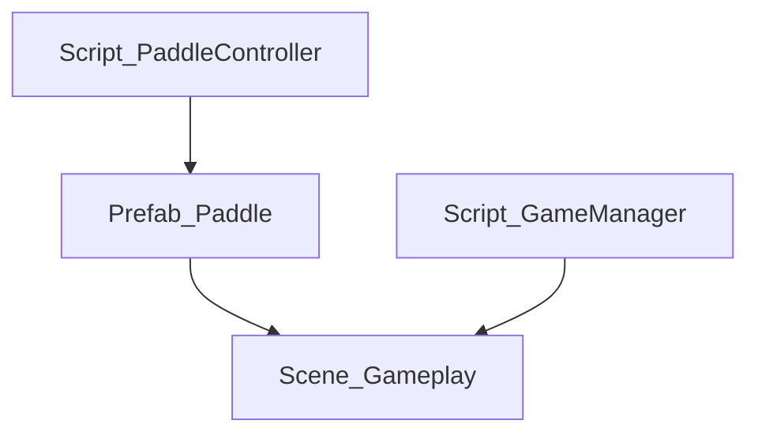

# MCP-Unity 集成说明

## 🎯 概述
通过MCP (Model Context Protocol) 将Unity Editor与Cursor集成，实现自动化项目功能扫描和文档生成。

## 📋 安装步骤

### 1. 安装MCP-Unity插件
```bash
# 在Unity项目中安装MCP-Unity包
# 可通过Package Manager或Git URL安装
```

### 2. 配置Cursor MCP设置
在Cursor中配置MCP服务器：
```json
{
  "mcpServers": {
    "unity": {
      "command": "unity-mcp-server",
      "args": ["--project", "path/to/PongHub_demo"]
    }
  }
}
```

### 3. 使用Unity Editor脚本
1. 打开Unity Editor
2. 菜单栏选择 `PongHub/工具/生成功能跟踪表`
3. 选择要扫描的资产类型
4. 点击"开始扫描并生成表格"

## 🔧 自动化工作流

### 通过Cursor触发Unity扫描
```bash
# 在Cursor中执行命令
/mcp unity scan-assets
/mcp unity generate-tracking-table
/mcp unity update-dependencies
```

### 定时自动更新
可以设置定时任务，定期扫描项目资产并更新文档：
```csharp
// 在Unity Editor脚本中添加定时更新功能
[InitializeOnLoad]
public class AutoScanner
{
    static AutoScanner()
    {
        EditorApplication.update += OnEditorUpdate;
    }

    private static void OnEditorUpdate()
    {
        // 检查是否需要更新
        if (ShouldUpdate())
        {
            ProjectFeatureScanner.GenerateFeatureTrackingTable();
        }
    }
}
```

## 📊 功能特性

### 1. 资产扫描
- ✅ 脚本文件 (.cs)
- ✅ 预制件 (.prefab)
- ✅ 场景文件 (.unity)
- ✅ 材质文件 (.mat)
- ✅ 音频文件 (.wav, .mp3)
- ✅ 特效预制件 (VFX)

### 2. 自动生成内容
- 📋 功能跟踪表格
- 🔗 资产依赖关系图
- 📝 脚本接口文档
- 📈 进度统计报告

### 3. Mermaid可视化
自动生成资产依赖关系的Mermaid图表：


## 🚀 使用建议

1. **定期扫描**：每次添加新资产后运行扫描
2. **版本控制**：将生成的文档提交到Git
3. **团队协作**：通过MCP实现团队间的自动化同步
4. **进度跟踪**：结合TODO系统跟踪未完成功能

## 📝 注意事项

- 生成的文档会覆盖 `Documentation/Project_Feature_Tracking_Auto.md`
- 手动修改的内容可能被自动覆盖
- 建议在Git中保留手动维护的版本
- MCP-Unity需要Unity 2021.3或更高版本

---

*此集成方案将大大提高项目文档的维护效率和准确性。*