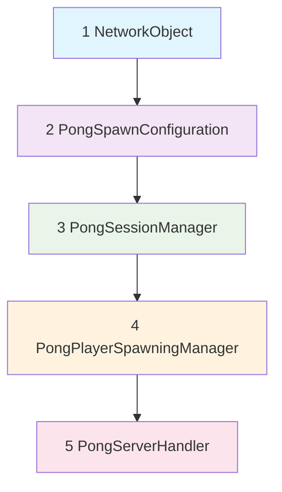

# 竞技场配置指南

## 📋 概述

本文档详细说明如何在 Unity 中配置乒乓球 VR 竞技场系统，包括脚本挂载方式、执行顺序要求和具体配置步骤。

## 🎯 ArenaLifeCycle 对象脚本配置

### **当前 Gym 场景中的 ArenaLifeCycle 对象**

路径：`Assets/TirgamesAssets/SchoolGym/Gym.unity` → `ArenaLifeCycle`

### **脚本替换方案**

#### **🔄 需要替换的组件**

| 原组件                       | 新组件                      | 说明                 |
| ---------------------------- | --------------------------- | -------------------- |
| `ArenaPlayerSpawningManager` | `PongPlayerSpawningManager` | 乒乓球专用生成管理器 |
| `ArenaSessionManager`        | `PongSessionManager`        | 乒乓球会话管理器     |
| `ArenaServerHandler`         | `PongServerHandler`         | 乒乓球服务器处理器   |

#### **✅ 保留的组件**

- `NetworkObject` - 网络同步组件（必须保留）
- `Transform` - 基础变换组件

#### **➕ 新增的组件**

- `PongSpawnConfiguration` - 乒乓球生成点配置

## ⚡ 脚本挂载顺序要求

### **📌 重要：脚本执行顺序有严格要求！**

根据依赖关系分析，**必须按照以下顺序挂载脚本**：



### **🔧 推荐的组件挂载顺序**

1. **`NetworkObject`** (自动存在，无需添加)

   - 优先级：最高
   - 必须最先初始化

2. **`PongSpawnConfiguration`**

   - 依赖：Transform
   - 职责：管理生成点配置

3. **`PongSessionManager`** (Singleton)

   - 依赖：NetworkObject
   - 职责：管理游戏会话和玩家数据

4. **`PongPlayerSpawningManager`**

   - 依赖：PongSpawnConfiguration, PongSessionManager
   - 职责：处理玩家生成逻辑

5. **`PongServerHandler`**
   - 依赖：PongSessionManager
   - 职责：处理网络事件

### **⚠️ 为什么顺序很重要？**

1. **初始化依赖**：

   - `PongPlayerSpawningManager.Awake()` 需要查找 `PongSpawnConfiguration`
   - `PongServerHandler` 在 `OnNetworkSpawn()` 中访问 `PongSessionManager.Instance`

2. **Singleton 模式**：

   - `PongSessionManager` 必须在其他组件访问 `Instance` 之前初始化

3. **网络事件订阅**：
   - 各组件的 `OnNetworkSpawn()` 需要按正确顺序执行

## 🛠️ Unity 编辑器配置步骤

### **步骤 1：备份场景**

```bash
复制 Gym.unity → Gym_Backup.unity
```

### **步骤 2：选择 ArenaLifeCycle 对象**

1. 打开 `Assets/TirgamesAssets/SchoolGym/Gym.unity`
2. 在 Hierarchy 面板中选择 `ArenaLifeCycle`

### **步骤 3：移除原有组件**

```text
右键点击以下组件 → Remove Component：
- ArenaPlayerSpawningManager
- ArenaSessionManager
- ArenaServerHandler
```

### **步骤 4：按顺序添加新组件**

#### **4.1 添加 PongSpawnConfiguration**

```text
Add Component → Scripts → Arena → Services → PongSpawnConfiguration
```

#### **4.2 添加 PongSessionManager**

```text
Add Component → Scripts → Arena → Services → PongSessionManager
```

#### **4.3 添加 PongPlayerSpawningManager**

```text
Add Component → Scripts → Arena → Services → PongPlayerSpawningManager
```

#### **4.4 添加 PongServerHandler**

```text
Add Component → Scripts → Arena → Services → PongServerHandler
```

### **步骤 5：验证组件顺序**

最终 Inspector 面板中的组件顺序应该是：

```text
✅ Transform
✅ NetworkObject
✅ PongSpawnConfiguration
✅ PongSessionManager
✅ PongPlayerSpawningManager
✅ PongServerHandler
```

## ⚙️ 组件配置参数

### **PongSpawnConfiguration 配置**

#### **基础设置**

```csharp
[Header("球桌配置")]
球桌Transform: 拖入球桌的Transform组件
球桌中心偏移: (0, 0, 0)
```

#### **生成点配置**

```csharp
[Header("玩家生成点")]
A1生成点: 拖入A队主要位置Transform
A2生成点: 拖入A队次要位置Transform
B1生成点: 拖入B队主要位置Transform
B2生成点: 拖入B队次要位置Transform

[Header("观众生成点")]
A侧观众席: 拖入观众席Transform容器
B侧观众席: 拖入观众席Transform容器
中立观众席: 拖入中立观众席Transform容器
```

#### **VR 安全设置**

```csharp
[Header("VR空间安全")]
玩家安全半径: 1.5f (米)
球桌缓冲距离: 1.5f (米)
最小玩家间距: 2.0f (米)
```

### **PongPlayerSpawningManager 配置**

#### **预制体引用**

```csharp
[Header("生成配置")]
生成配置引用: 拖入同对象上的PongSpawnConfiguration组件
```

#### **VR 传送效果**

```csharp
[Header("VR传送效果")]
传送音效: 拖入传送音效AudioClip
传送持续时间: 1.0f (秒)
```

#### **调试设置**

```csharp
[Header("调试设置")]
记录生成事件: true (开发时建议开启)
```

### **PongSessionManager 配置**

> **注意**：`PongSessionManager` 是 Singleton 模式，无需手动配置参数。
> 所有设置通过代码动态管理。

### **PongServerHandler 配置**

> **注意**：`PongServerHandler` 主要处理网络事件，无需手动配置参数。

## 🎮 生成点布局设计

### **球桌周围布局**

```text
     观众席B        观众席B
    [B2位置]       [B1位置]
        ↑             ↑
    ==================
    |               |
    |   乒乓球桌     |
    |               |
    ==================
        ↓             ↓
    [A1位置]       [A2位置]
     观众席A        观众席A
```

### **距离规范**

- **A1/B1 主位**：距离球桌边缘 1.5 米
- **A2/B2 副位**：距离球桌边缘 1.5 米，侧向偏移
- **观众席**：距离球桌边缘 3.0 米
- **玩家间距**：最小间距 2.0 米

## 🔍 配置验证清单

### **✅ 挂载检查**

- [ ] 组件按正确顺序挂载
- [ ] NetworkObject 存在且配置正确
- [ ] 所有脚本引用都已连接

### **✅ 生成点检查**

- [ ] 4 个玩家生成点已配置
- [ ] 观众席生成点已配置
- [ ] 生成点位置符合 VR 安全要求

### **✅ 功能测试**

- [ ] 单打模式(1v1)正常工作
- [ ] 双打模式(2v2)正常工作
- [ ] 观众模式正常工作
- [ ] 玩家传送效果正常

## 🐛 常见问题排除

### **问题 1：组件初始化顺序错误**

```text
错误信息：NullReferenceException in PongPlayerSpawningManager.Awake()
解决方案：检查PongSpawnConfiguration是否在PongPlayerSpawningManager之前挂载
```

### **问题 2：Singleton 未初始化**

```text
错误信息：PongSessionManager.Instance is null
解决方案：确保PongSessionManager在其他依赖组件之前挂载
```

### **问题 3：网络事件未注册**

```text
症状：玩家连接但没有触发生成
解决方案：检查PongServerHandler是否正确挂载并初始化
```

### **问题 4：生成点配置丢失**

```text
症状：玩家生成在原点(0,0,0)
解决方案：重新配置PongSpawnConfiguration中的生成点引用
```

## 📋 配置模板

### **快速配置脚本**

可以使用以下 Unity Editor 脚本快速配置：

```csharp
// 放置在 Editor 文件夹中
[MenuItem("PongHub/Configure Arena LifeCycle")]
public static void ConfigureArenaLifeCycle()
{
    var arenaLifeCycle = GameObject.Find("ArenaLifeCycle");
    if (arenaLifeCycle == null) return;

    // 移除旧组件
    DestroyImmediate(arenaLifeCycle.GetComponent<ArenaPlayerSpawningManager>());
    DestroyImmediate(arenaLifeCycle.GetComponent<ArenaSessionManager>());
    DestroyImmediate(arenaLifeCycle.GetComponent<ArenaServerHandler>());

    // 添加新组件（按正确顺序）
    arenaLifeCycle.AddComponent<PongSpawnConfiguration>();
    arenaLifeCycle.AddComponent<PongSessionManager>();
    arenaLifeCycle.AddComponent<PongPlayerSpawningManager>();
    arenaLifeCycle.AddComponent<PongServerHandler>();

    Debug.Log("ArenaLifeCycle 配置完成！");
}
```

## 🎯 最佳实践建议

1. **总是按推荐顺序挂载组件**
2. **配置完成后立即测试基础功能**
3. **使用版本控制保存配置状态**
4. **定期备份场景文件**
5. **在团队中统一配置标准**

---

**配置完成后，您的乒乓球 VR 竞技场就可以支持智能匹配、VR 优化生成和完整的多人游戏体验了！** 🏓
