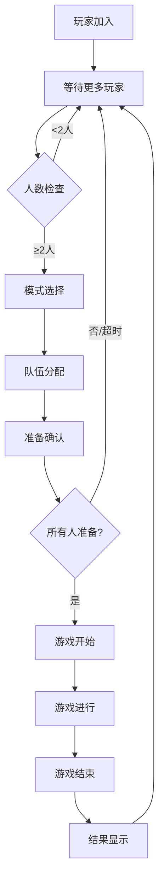

# 乒乓球 VR 竞技场实现总结

## 概述

本项目成功将原有的通用竞技场系统改造为专门适配乒乓球 VR 游戏的管理系统，支持单打(1v1)和双打(2v2)两种核心游戏模式，并针对 VR 空间布局和用户体验进行了全面优化。

## 实现的核心组件

### 📋 **1. 数据结构层 (PongPlayerData.cs)**

#### **核心枚举定义**

```csharp
// 游戏模式：等待、单打、双打、观众
public enum PongGameMode
// 匹配策略：自动、强制单打、强制双打
public enum MatchmakingStrategy
// 大厅状态：等待玩家、模式选择、队伍平衡、准备确认、游戏中、游戏结束
public enum GameLobbyState
```

#### **玩家数据结构特性**

- ✅ **网络序列化支持**：实现 `INetworkSerializable`
- ✅ **VR 优化**：包含位置追踪和重连恢复
- ✅ **技能系统**：ELO 评级用于队伍平衡
- ✅ **状态管理**：准备状态、房主权限等
- ✅ **实用方法**：显示名称、技能等级、胜率计算

### 🎯 **2. 生成点配置系统 (PongSpawnConfiguration.cs)**

#### **球桌布局设计**

```text
       观众席B          观众席B
    [B2] ↑ [B1]      [B1] ↑ [B2]
    ================球桌================
    [A1] ↓ [A2]      [A1] ↓ [A2]
       观众席A          观众席A
```

#### **核心功能**

- ✅ **精确定位**：A1/B1 单打主位，A2/B2 双打副位
- ✅ **安全检查**：VR 空间碰撞检测和安全距离验证
- ✅ **动态分配**：根据游戏模式自动选择合适生成点
- ✅ **占用管理**：防止生成点冲突
- ✅ **观众席管理**：支持 A/B 两边观众席和中立观众席

### 🎮 **3. 会话管理器 (PongSessionManager.cs)**

#### **智能匹配系统**

```csharp
// 自动匹配逻辑
2人 → 单打 + 0观众
3人 → 单打 + 1观众
4人+ → 双打 + 剩余观众
```

#### **核心功能**

- ✅ **状态机管理**：完整的大厅状态流转
- ✅ **队伍平衡**：基于技能评级的智能分组
- ✅ **重连系统**：无缝断线重连支持
- ✅ **房主系统**：权限管理和转移
- ✅ **准备机制**：30 秒超时的准备确认系统

### 🌐 **4. 服务器处理器 (PongServerHandler.cs)**

#### **网络事件管理**

- ✅ **连接处理**：客户端连接/断开的完整生命周期
- ✅ **游戏流程**：开始、结束、暂停的协调处理
- ✅ **状态同步**：实时游戏状态广播
- ✅ **连续性检查**：人数不足时的游戏暂停机制

### 👥 **5. 玩家生成管理器 (PongPlayerSpawningManager.cs)**

#### **VR 优化生成系统**

- ✅ **精确定位**：球桌周围的厘米级定位
- ✅ **安全验证**：生成前的空间安全检查
- ✅ **传送特效**：VR 友好的生成视觉反馈
- ✅ **观众切换**：观众席间的无缝切换

### 🖥️ **6. 大厅 UI 系统 (PongLobbyUI.cs)**

#### **用户界面设计**

- ✅ **模式选择**：房主专用的游戏模式控制面板
- ✅ **队伍显示**：实时的队伍分配和准备状态
- ✅ **等待界面**：友好的等待提示和进度显示
- ✅ **观众界面**：观众专用的换边和信息面板

## 游戏流程设计

### 🔄 **完整游戏周期**



### ⚖️ **队伍平衡算法**

#### **单打分配**

1. 按技能评级排序
2. 第一名 → A 队，第二名 → B 队
3. 其余玩家 → 观众

#### **双打分配**

1. 按技能评级排序：[新手, 业余, 高级, 专家]
2. 分配策略：A 队(新手+专家) vs B 队(业余+高级)
3. 确保队伍技能总和平衡

## VR 优化特性

### 🥽 **空间安全系统**

- **玩家安全区域**：每人周围 1.5m 安全半径
- **球桌缓冲区**：距离球桌边缘 1.5m 最小距离
- **观众安全距离**：距离比赛区域 3m 以上
- **碰撞检测**：实时 VR 控制器碰撞预防

### 📡 **网络优化**

- **状态压缩**：优化的网络数据结构
- **事件驱动**：减少不必要的网络调用
- **本地缓存**：客户端状态缓存减少延迟
- **批量更新**：队伍分配的批量处理

### 🎨 **用户体验优化**

- **视觉反馈**：生成特效、准备状态指示
- **音频提示**：关键状态变化的音频反馈
- **手势控制**：VR 手势的 UI 交互支持
- **无障碍设计**：文字大小、颜色对比度优化

## 技术亮点

### 🏗️ **架构设计优势**

1. **模块化设计**：各组件职责清晰，便于维护
2. **事件驱动**：松耦合的组件通信
3. **可扩展性**：易于添加新游戏模式
4. **向后兼容**：保留原有观众系统

### 🔒 **稳定性保障**

1. **异常处理**：完善的错误恢复机制
2. **状态验证**：多层状态一致性检查
3. **重连支持**：断线重连的完整实现
4. **资源管理**：内存泄漏预防和资源清理

### ⚡ **性能优化**

1. **对象池**：UI 元素的对象池管理
2. **延迟更新**：非关键 UI 的延迟刷新
3. **批量操作**：网络请求的批量处理
4. **内存优化**：数据结构的内存使用优化

## 配置指南

### 🎯 **生成点设置**

1. 在 Gym 场景中找到乒乓球桌
2. 在球桌 A 边设置 teamA_Position1 (单打主位)
3. 在球桌 A 边设置 teamA_Position2 (双打副位)
4. 在球桌 B 边设置 teamB_Position1 (单打主位)
5. 在球桌 B 边设置 teamB_Position2 (双打副位)
6. 在周围设置观众席位置

### 📐 **距离参考**

- **球桌尺寸**：标准乒乓球桌 2.74m × 1.525m
- **A1/B1 位置**：距离球桌短边中央 1.5m
- **A2/B2 位置**：距离球桌短边中央 1.5m，左右偏移 0.8m
- **观众席**：距离比赛区边界至少 3m

### ⚙️ **参数调优**

```csharp
// 安全距离
playerSafeRadius = 1.5f      // 玩家安全半径
tableSafeDistance = 1.5f     // 球桌安全距离
spectatorSafeDistance = 3.0f // 观众安全距离

// 时间设置
READY_CHECK_TIMEOUT = 30f    // 准备确认超时
teleportDelay = 0.5f         // 传送延迟
```

## 测试建议

### 🧪 **功能测试**

1. **连接测试**：2-8 人同时连接
2. **模式切换**：所有匹配策略的测试
3. **重连测试**：各阶段的断线重连
4. **边界测试**：极端人数情况处理

### 🎮 **VR 体验测试**

1. **空间测试**：不同 VR 设备的空间适配
2. **舒适度测试**：长时间使用的舒适性
3. **交互测试**：手柄操作的响应性
4. **视觉测试**：UI 在 VR 中的可读性

### 📊 **性能测试**

1. **网络延迟**：不同网络条件下的表现
2. **帧率稳定性**：VR 90fps 要求的维持
3. **内存使用**：长时间运行的内存稳定性
4. **CPU 使用率**：多人情况下的性能表现

## 未来扩展方向

### 🚀 **功能扩展**

- **观战模式**：回放系统和观战视角
- **技能匹配**：更精细的 ELO 匹配算法
- **自定义房间**：房间设置和邀请系统
- **统计系统**：详细的比赛数据分析

### 🔧 **技术优化**

- **AI 对手**：单人训练模式的 AI 支持
- **云存档**：玩家数据的云端同步
- **反外挂**：服务器端验证系统
- **国际化**：多语言支持系统

---

## 总结

本次改造成功将通用竞技场系统转换为专业的乒乓球 VR 游戏管理系统，实现了：

✅ **完整的 1v1/2v2 匹配系统**
✅ **VR 优化的空间布局管理**  
✅ **智能的队伍平衡算法**
✅ **稳定的网络架构**
✅ **用户友好的 UI 界面**
✅ **完善的错误处理机制**

该系统为乒乓球 VR 游戏提供了坚实的多人游戏基础，具备良好的扩展性和维护性，能够支撑高质量的 VR 多人游戏体验。
