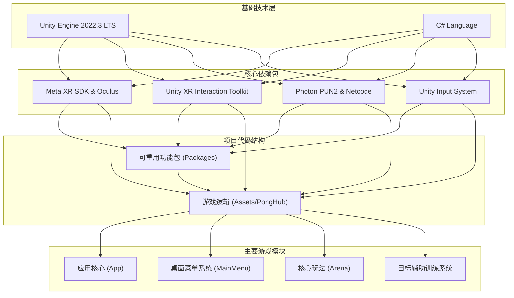

# GEMINI.md - PongHub VR 项目指南

本文档为 Gemini 及新加入的开发者提供 PongHub VR 项目的核心信息概览，旨在快速了解项目背景、技术架构、开发规范和当前状态。

## 1. 项目概述

**PongHub VR** 是一款基于 Unity 引擎开发的沉浸式VR乒乓球游戏。项目致力于提供真实的物理反馈、流畅的多人对战体验以及专为VR优化的直观交互。

### 核心特性
- **真实物理模拟**: 高度还原乒乓球的旋转、速度和反弹效果。
- **多人在线对战**: 基于 Photon 和 Unity Netcode 实现流畅的多人游戏体验。
- **沉浸式VR交互**: 充分利用 Meta XR SDK，提供自然的手部交互和菜单系统。
- **统一场景架构**: 消除传统菜单与游戏场景的割裂感，实现无缝模式切换。
- **目标辅助训练系统 (TATS)**: 创新的训练模式，通过物理预测和可视化引导，帮助玩家提升技能。

## 2. 技术架构

项目采用模块化设计，分为可重用的核心功能包和游戏特定逻辑。

### 技术栈
| 技术领域 | 主要技术 |
|---|---|
| **游戏引擎** | Unity 2022.3 LTS |
| **开发语言** | C# |
| **VR SDK** | Meta XR SDK, Unity XR Interaction Toolkit, Oculus Integration |
| **网络方案** | Photon PUN2, Unity Netcode for GameObjects |
| **输入系统** | Unity Input System |
| **UI 系统** | Unity UI Toolkit, Canvas World Space |
| **性能优化** | Burst Compiler, Job System |

### 架构图

## 3. 代码结构与规范

- **核心包 (`/Packages`)**: 存放与具体游戏逻辑无关、可在多项目中重用的代码，如 `com.meta.multiplayer.netcode-photon` 和 `com.meta.utilities`。
- **游戏逻辑 (`/Assets/PongHub`)**: 存放所有游戏特定代码。
  - `/Scripts/App`: 应用启动和生命周期管理。
  - `/Scripts/MainMenu`: 新的沉浸式桌面菜单系统。
  - `/Scripts/Arena`: 核心游戏场景逻辑，包括玩家、球、观众等。
  - `/Scripts/TargetAssist`: 目标辅助训练系统 (TATS) 的实现。
- **文档 (`/Documentation`)**: 存放设计文档、SOP和Bug修复记录。
- **工作日志 (`/WorkLog`)**: 记录每日开发进展。
- **AI文档 (`/.ai`)**: 存放由AI生成的架构、需求等文档。

**开发规范**:
- **编码风格**: 遵循 C# 标准编码规范，参考现有代码风格。
- **版本控制**: 使用 Git 进行版本控制，Commit Message 需清晰明了。
- **文档更新**: 在进行重要功能开发或修改时，及时更新相关设计文档。
- **工作日志**: 每日下班前在 `/WorkLog` 目录下提交当天的工作日志。

## 4. 当前开发重点

根据最新的工作日志和设计文档，项目当前的开发重点如下：

- **Epic-2: 桌面菜单 UI 系统**:
  - **目标**: 替换旧的独立 `MainMenu` 场景，实现一个完全沉浸在游戏环境中的桌面菜单。
  - **状态**: **进行中**。UI布局和核心交互逻辑正在开发。

- **Epic-3: 输入系统整合优化**:
  - **目标**: 统一和优化现有的多个输入系统，提升VR交互的响应速度和准确性，并实现零GC（垃圾回收）的输入处理。
  - **状态**: **编译完成，待测试**。已于 `2025-08-01` 修复所有编译错误，即将进入功能和性能测试阶段。

## 5. 如何开始

1. **熟悉项目**: 阅读本 `GEMINI.md` 文件，然后浏览 `/Documentation` 目录下的核心设计文档。
2. **查看任务**: 了解当前正在进行的 Epic 和 Story。
3. **配置环境**: 确保本地 Unity Editor、SDK 和相关包版本与项目一致。
4. **编译运行**: 在本地成功编译并运行项目，熟悉核心功能。
5. **开始开发**: 根据分配的任务，遵循开发规范进行编码。

---
*本文档由 Gemini 根据项目现有文档自动生成，最后更新于 2025年8月1日。*
