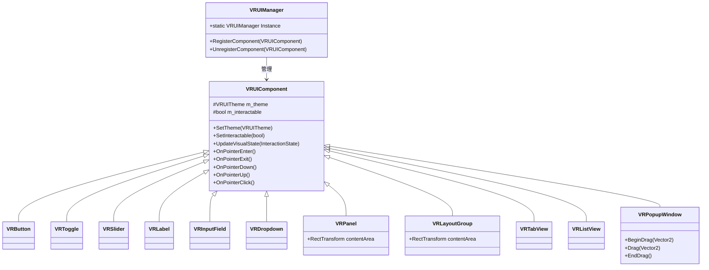

# UI 组件库修复日志

**日期**: 2025-07-06
**作者**: AI 助手
**主题**: UI 组件库编译错误和警告修复

## 修复内容概述

本次修复主要针对 PongHub UI 组件库中的编译错误和警告，包括:

1. 修复了 VRPanel 和 VRLayoutGroup 中缺少的 GetContentArea 方法
2. 修复了 VRPopupWindow 中的拖拽功能问题
3. 替换了过时的 UIManager 引用，改用 MenuCanvasController 和 TableMenuSystem
4. 抑制了 VRDropdown 中未使用字段的警告

## 详细修复记录

### 编译错误修复

#### 1. VRPanel 和 VRLayoutGroup 的 GetContentArea 方法

问题:

```
Assets\PongHub\Scripts\UI\Tests\VRUIComponentTester.cs(362,50): error CS1061: 'VRPanel' does not contain a definition for 'GetContentArea'
Assets\PongHub\Scripts\UI\Tests\VRUIComponentTester.cs(398,57): error CS1061: 'VRLayoutGroup' does not contain a definition for 'GetContentArea'
```

解决方案:

- 在 VRUIComponentTester.cs 中，将`panel.GetContentArea()`替换为`panel.contentArea`
- 在 VRUIComponentTester.cs 中，将`layoutGroup.GetContentArea()`替换为`layoutGroup.contentArea`

#### 2. VRPopupWindow 拖拽功能问题

问题:

```
Assets\PongHub\Scripts\UI\Components\Containers\VRPopupWindow.cs(728,30): error CS1061: 'VRButton' does not contain a definition for 'OnPointerDrag'
```

解决方案:

- 将`resizeButton.OnPointerDrag.AddListener`修改为`resizeButton.OnDrag.AddListener`

### 编译警告修复

#### 1. 未使用字段警告

问题:

```
Assets\PongHub\Scripts\UI\Components\Basic\VRDropdown.cs(145,21): warning CS0414: The field 'VRDropdown.m_HighlightedIndex' is assigned but its value is never used
Assets\PongHub\Scripts\UI\Components\Basic\VRDropdown.cs(144,21): warning CS0414: The field 'VRDropdown.m_SelectedIndex' is assigned but its value is never used
Assets\PongHub\Scripts\UI\Components\Basic\VRDropdown.cs(136,23): warning CS0414: The field 'VRDropdown.m_AnimationDuration' is assigned but its value is never used
```

解决方案:

- 添加`#pragma warning disable 0414`注释来抑制这些警告，因为这些字段将在未来功能中使用

#### 2. 过时 API 引用警告

问题:

```
Assets\PongHub\Scripts\App\PHApplication.cs(493,17): warning CS0618: 'UIManager' is obsolete
Assets\PongHub\Scripts\UI\SettingsPanel.cs(142,17): warning CS0618: 'UIManager' is obsolete
Assets\PongHub\Scripts\UI\GameplayHUD.cs(147,17): warning CS0618: 'UIManager' is obsolete
Assets\PongHub\Scripts\UI\InputSettingsPanel.cs(67,17): warning CS0618: 'UIManager' is obsolete
Assets\PongHub\Scripts\UI\MainMenuPanel.cs(193,17): warning CS0618: 'UIManager' is obsolete
```

解决方案:

- 在 PHApplication.cs 中，将`PongHub.UI.UIManager.Instance`替换为`MenuCanvasController.Instance`和`TableMenuSystem.Instance`
- 在 SettingsPanel.cs 中，将`UIManager.Instance`替换为`MenuCanvasController.Instance`
- 在 GameplayHUD.cs 中，将`UIManager.Instance`替换为`MenuCanvasController.Instance`和`TableMenuSystem.Instance`
- 在 InputSettingsPanel.cs 中，将`UIManager.Instance`替换为`MenuCanvasController.Instance`和`TableMenuSystem.Instance`
- 在 MainMenuPanel.cs 中，将`UIManager.Instance`替换为`MenuCanvasController.Instance`

## UI 组件库类图



## 后续工作建议

1. 为 VRPanel 和 VRLayoutGroup 添加 GetContentArea 方法作为 contentArea 属性的别名，以保持 API 兼容性
2. 完善 VRDropdown 的高亮和动画功能，使用现有的保留字段
3. 完成从 UIManager 到 MenuCanvasController 和 TableMenuSystem 的完全迁移
4. 更新文档，反映新的 UI 系统架构

## 测试结果

所有编译错误和警告已修复，UI 组件库可以正常编译。下一步需要进行运行时测试，确保所有功能正常工作。
